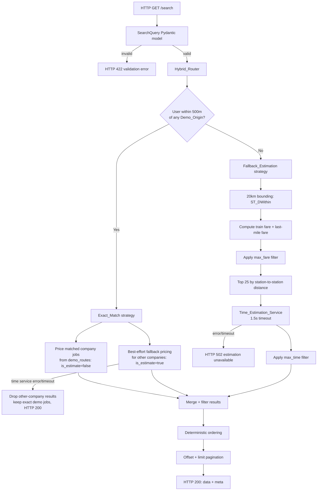
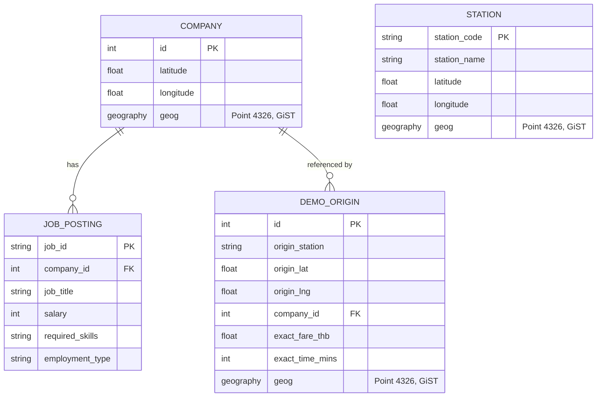

# Design Document

## Overview

This feature adds a FastAPI search endpoint backed by a PostGIS-enabled PostgreSQL database. The endpoint accepts a user's geographic coordinates plus optional fare, commute-time, and pagination limits, and returns job postings priced by commute cost using a **Hybrid Routing Strategy**:

- **Exact_Match** — when the user starts at or within 500 m (the Hero_Radius) of a predefined Demo_Origin, the matched company's jobs are priced with the exact fare and time from `demo_routes.csv` (`is_estimate = false`). All other companies are still priced on a best-effort basis via the fallback strategy (`is_estimate = true`).
- **Fallback_Estimation** — when the user is outside every Hero_Radius, all candidate companies within a 20 km bounding radius are priced spatially (train fare from station-to-station distance plus an optional last-mile surcharge) and timed via an external time API (`is_estimate = true`).

Results are filtered by maximum fare (before the top-25 candidate selection) and maximum commute time (after time estimation), ordered deterministically, then paginated. The endpoint targets a 3-second response SLA and a strict database-query budget.

The scope is limited to the SQLAlchemy data models and the FastAPI routing logic. The four CSV files under `datasets/` are the data source for a one-time load into PostGIS tables.

### Technical decisions and research notes

- **Spatial engine — PostGIS `geography` type.** All coordinate columns use the PostGIS `geography(Point, 4326)` type so that `ST_Distance` and `ST_DWithin` return results in **meters** using true geodesic distance, avoiding manual haversine math and projection errors. `ST_DWithin` on a `geography` column with a GiST index performs an index-assisted radius search, which is what keeps the 20 km bounding check and the 500 m hero check fast. ([PostGIS ST_DWithin docs](https://postgis.net/docs/ST_DWithin.html), [ST_Distance docs](https://postgis.net/docs/ST_Distance.html))
- **ORM mapping — GeoAlchemy2.** GeoAlchemy2 provides the SQLAlchemy `Geography` column type and exposes PostGIS functions (`func.ST_DWithin`, `func.ST_Distance`) so the spatial query can be expressed in the ORM and composed into CTEs. ([GeoAlchemy2 docs](https://geoalchemy-2.readthedocs.io/))
- **Validation — Pydantic v2 + FastAPI.** FastAPI request models validate coordinate ranges and numeric bounds and automatically return HTTP 422 with per-field detail when validation fails, satisfying the Requirement 1 validation criteria without hand-written checks.
- **Time estimation — Google Distance Matrix API.** A single batched request carries up to 25 destinations (the Candidate_Company_Limit) from one origin, minimizing round trips. The call uses an async HTTP client (`httpx.AsyncClient`) with a hard 1.5 s timeout so the endpoint stays within the 3 s global SLA. ([Google Distance Matrix API](https://developers.google.com/maps/documentation/distance-matrix/overview))
- **Query budget — CTE-based composition.** The spatial candidate selection (user's nearest station, per-company nearest station, fare computation, fare filter, top-25 ordering) is composed into a single SQL statement using CTEs and `LATERAL` joins so the whole request stays within the 4-query bound of Requirement 6.

> Note on the workspace no-testing policy: per `.kiro/steering/no-testing.md`, this design does not define automated tests. The "Correctness Properties" section below documents system invariants for correctness reasoning only, and the "Verification Strategy" section describes non-test verification (build, type checks, and manual reasoning).

## Architecture

The endpoint is organized into thin transport, validation, orchestration, strategy, and data-access layers. The orchestrator (`Hybrid_Router`) selects a strategy, delegates pricing, then applies shared filtering, ordering, and pagination.



### Strategy selection (Hybrid_Router)

1. Run a single PostGIS query against `demo_origins` using `ST_DWithin(origin_geog, user_point, 500)` ordered by `ST_Distance` ascending, then by `company_id` ascending, `LIMIT 1`.
2. If a row is returned → **Exact_Match** (the nearest demo origin, ties broken by lowest `company_id`).
3. If no row is returned → **Fallback_Estimation**.

Both strategies converge on the same downstream pipeline: merge → filter → order → paginate → serialize. This keeps the pricing logic separated from the shared assembly logic.

### Request lifecycle and query budget

To honor the 4-query maximum (Requirement 6.3) and the 3 s SLA (Requirement 6.5):

| Step | Query | Notes |
|------|-------|-------|
| 1 | Demo-origin proximity check | `ST_DWithin` + order + `LIMIT 1`. |
| 2 | Candidate company selection (fallback pool) | Single CTE statement: user's nearest station, per-company nearest station (`LATERAL`), train + last-mile fare, `max_fare` filter, top-25 by station-to-station distance. |
| 3 | Job postings for all matched companies | Single set-based `SELECT ... JOIN company WHERE company_id IN (:ids)` covering both the exact-match company and the fallback top-25. |

The exact-match path reuses steps 2 and 3 (it runs the fallback pool for "other" companies and adds the demo company id to the job-posting `IN` list), so the total stays at 3 queries — within the 4-query bound. The single external Time_Estimation_Service call is an HTTP request, not a database query, and does not count against the budget.

## Components and Interfaces

### 1. Transport layer — `search_router`

FastAPI router exposing `GET /search`. Responsibilities: bind query parameters to the `SearchQuery` model (FastAPI raises HTTP 422 automatically on validation failure), invoke the orchestrator, and serialize the `SearchResponse`.

```python
@router.get("/search", response_model=SearchResponse)
async def search(query: Annotated[SearchQuery, Query()], db: AsyncSession = Depends(get_session)) -> SearchResponse: ...
```

### 2. Request model — `SearchQuery` (Pydantic)

Encapsulates all input validation for Requirement 1.

| Field | Type | Rules | Requirement |
|-------|------|-------|-------------|
| `lat` | `float` (required) | -90 ≤ lat ≤ 90 | 1.2, 1.3 |
| `lng` | `float` (required) | -180 ≤ lng ≤ 180 | 1.2, 1.4 |
| `max_fare` | `float \| None` | 0.01 ≤ v ≤ 999999.99 | 1.5 |
| `max_time` | `int \| None` | integer, 1 ≤ v ≤ 1440 | 1.6 |
| `limit` | `int` = 50 | integer, 1 ≤ v ≤ 200 | 1.1, 1.7 |
| `offset` | `int` = 0 | integer, v ≥ 0 | 1.1, 1.8 |

Missing `lat`/`lng` and any out-of-range value both produce HTTP 422 with per-field detail and no search is performed (Requirement 1.2–1.8). Only when all fields validate does the request proceed (1.9).

### 3. Orchestrator — `HybridRouter`

```python
async def search_jobs(query: SearchQuery, db: AsyncSession) -> SearchResponse
```

- Calls `select_strategy(query, db)` → `("exact", demo_origin)` or `("fallback", None)`.
- Delegates to `ExactMatchStrategy` or `FallbackEstimationStrategy` to produce a flat list of `PricedJob` (a job record plus `fare_thb`, `commute_time_mins`, `is_estimate`).
- Applies shared assembly: fare/time filtering, deterministic ordering, pagination, and `meta` construction.

### 4. `ExactMatchStrategy`

- Prices the matched demo company's jobs directly from `exact_fare_thb` / `exact_time_mins` with `is_estimate = false` (Requirement 2.3, 2.5).
- Runs `FallbackEstimationStrategy` for every other company that passes the filters, bound to the same 20 km radius and 25-company cap, with `is_estimate = true`, merged into one unified list (Requirement 2.4).
- If the Time_Estimation_Service errors or times out during the best-effort computation, the fallback records are omitted and the exact demo jobs are still returned with HTTP 200 (never 502) (Requirement 2.4, 2.9).
- If the matched demo company has no jobs, only the fallback results are returned, still HTTP 200 (Requirement 2.8).

### 5. `FallbackEstimationStrategy`

Pipeline:
1. **Bounding** — `ST_DWithin(company_geog, user_point, 20000)` limits candidates to 20 km (Requirement 3.2).
2. **Train fare** — `15 + 2.5 * d_km`, where `d_km` is the non-negative `ST_Distance` (km) between the User's Nearest Station and the Company's Nearest Station, rounded to 2 dp (Requirement 3.3).
3. **Last-mile fare** — if the company is farther than 800 m from its nearest station, add `15 + 10 * last_mile_km` (2 dp); otherwise add 0. The user-side last-mile cost is treated as zero (Requirement 3.4, 3.5).
4. **Fare filter** — if `max_fare` provided, drop candidates whose total fare `> max_fare` (Requirement 3.6, 4.1, 4.3).
5. **Top-25** — order remaining candidates by station-to-station distance ascending and take the closest 25 (Requirement 3.7). This is the same distance metric used for the train fare in step 2.
6. **Time estimation** — one batched Time_Estimation_Service call (≤ 25 destinations), 1.5 s timeout; `commute_time_mins` = returned duration rounded to whole minutes (Requirement 3.8, 3.9).
7. **Time filter** — if `max_time` provided, drop jobs whose `commute_time_mins > max_time` (Requirement 3.10, 4.2, 4.4).
8. On error/timeout when fallback is the *selected* strategy → HTTP 502, no records (Requirement 3.12).

### 6. `TimeEstimationClient`

Wraps the Google Distance Matrix API. Single origin (user coordinates), up to 25 destinations (company coordinates), `httpx.AsyncClient` with `timeout=1.5`. Raises `TimeEstimationError` on non-200, malformed payload, per-element error status, or timeout. Callers decide whether that error is fatal (fallback-selected → 502) or non-fatal (exact-match best-effort → drop).

### 7. Data-access layer — `repository`

Encapsulates the three parameterized queries described in the Architecture query-budget table. Exposes:
- `find_nearest_demo_origin(user_point) -> DemoOrigin | None`
- `select_fallback_candidates(user_point, max_fare) -> list[CandidateCompany]` (returns company id, coordinates, computed fare, station-to-station distance, capped at 25)
- `fetch_jobs_for_companies(company_ids) -> list[JobPosting]` (single set-based query joining Company, Requirement 6.1, 6.2)

### 8. Response models

```python
class JobResult(BaseModel):
    job_id: str | None
    company_id: int | None
    job_title: str | None
    salary: int | None
    required_skills: str | None
    employment_type: str | None
    fare_thb: float          # 2 dp
    commute_time_mins: int    # whole minutes
    is_estimate: bool

class SearchMeta(BaseModel):
    total_records: int        # count before pagination
    limit: int
    offset: int

class SearchResponse(BaseModel):
    data: list[JobResult]
    meta: SearchMeta
```

Missing source values are serialized as `null` rather than omitted (Requirement 5.5).

## Data Models

The models map the four CSVs to PostGIS-backed tables. Each spatial table carries a `geography(Point, 4326)` column with a GiST index. Coordinate values are validated on load; empty or out-of-range coordinates cause the record to be excluded from spatial calculations (Requirement 7.5, 7.6). Note that `company_id` values in the CSVs appear as floats (e.g. `7.0`) and station rows may have empty `Latitude`/`Longitude` (e.g. station `A10`); the loader normalizes company ids to integers and skips coordinate-invalid rows.



### Company (`companies`) — Requirement 7.1
- `id: int` (PK) — normalized from the CSV `id` float.
- `latitude: float` (-90.0..90.0), `longitude: float` (-180.0..180.0).
- `geog: geography(Point, 4326)` derived from `(longitude, latitude)`, GiST-indexed.
- Source: `company_locations_cleaned_ready.csv` (`id`, `latitude`, `longitude`). Thai-language descriptive columns are not mapped.

### Job_Posting (`job_postings`) — Requirement 7.2
- `job_id: str` (PK), `company_id: int` (FK → `companies.id`).
- `job_title: str`, `salary: int`, `required_skills: str`, `employment_type: str`.
- Source: `mock_job_postings.csv`.

### Station (`stations`) — Requirement 7.3
- `station_code: str`, `station_name: str`, `latitude: float`, `longitude: float`.
- `geog: geography(Point, 4326)`, GiST-indexed.
- Source: `coordinate_station.csv` (`Station_Code`, `Station_Name_EN`, `Latitude`, `Longitude`). Rows with empty or out-of-range coordinates are excluded from nearest-station calculations (Requirement 7.5).

### Demo_Origin (`demo_origins`) — Requirement 7.4
- `origin_station: str`, `origin_lat: float` (-90.0..90.0), `origin_lng: float` (-180.0..180.0).
- `company_id: int` (FK → `companies.id`), `exact_fare_thb: float`, `exact_time_mins: int`.
- `geog: geography(Point, 4326)` from `(origin_lng, origin_lat)`, GiST-indexed.
- Source: `demo_routes.csv`.

### Referential integrity — Requirement 7.7
A Job_Posting or Demo_Origin referencing a `company_id` with no matching Company is excluded from search results. This is enforced at load time (rows with dangling foreign keys are skipped) and reinforced by the `INNER JOIN` to `companies` in the job-fetch query.

### Derived / in-memory types
- `CandidateCompany` — company id, `geog`, computed `fare_thb`, and `station_to_station_km` (the ordering key).
- `PricedJob` — a `JobPosting` plus `fare_thb`, `commute_time_mins`, `is_estimate`; the unit passed through filtering, ordering, and pagination.

## Correctness Properties

*A property is a characteristic or behavior that should hold true across all valid executions of the system — a formal statement about what the system should do.*

Per the workspace no-testing policy, the properties below are documented as **design invariants for correctness reasoning**, not as specifications for automated tests. They describe the conditions any correct implementation must maintain and serve as the checklist for manual review and reasoning during implementation.

### Property 1: Input validation gates all searches
For all requests, if `lat`/`lng` are missing or any provided value is out of its declared range, the endpoint returns HTTP 422 with per-field detail and performs no search; only when every field validates does a search proceed.
**Validates: Requirements 1.2, 1.3, 1.4, 1.5, 1.6, 1.7, 1.8, 1.9**

### Property 2: Strategy selection is proximity-determined and deterministic
For all user coordinates, Exact_Match is selected if and only if the user is at or within 500 m of at least one Demo_Origin; otherwise Fallback_Estimation is selected. When multiple demo origins qualify, the one with the smallest geographic distance is chosen, with ties broken by the lowest `company_id`.
**Validates: Requirements 2.1, 2.2, 2.6, 2.7, 3.1**

### Property 3: Exact-match records carry exact pricing and a false estimate flag
For all exact-match selections, every job of the matched demo company is priced with that origin's `exact_fare_thb` and `exact_time_mins` and `is_estimate = false`, applied only to jobs whose `company_id` equals the matched demo origin's `company_id`.
**Validates: Requirements 2.3, 2.5**

### Property 4: Best-effort fallback in exact mode never fails the exact response
For all exact-match selections, other companies are priced by the fallback strategy (bound to 20 km and 25 candidates, `is_estimate = true`) and merged into the same response list; if time estimation errors or times out, those fallback records are omitted while the exact demo jobs are still returned with HTTP 200 (never 502). If the matched company has no jobs, only the fallback results are returned with HTTP 200.
**Validates: Requirements 2.4, 2.8, 2.9**

### Property 5: Train fare formula
For all candidate companies, the train fare equals `15 + 2.5 * d_km` where `d_km` is the non-negative station-to-station geodesic distance in kilometers, rounded to 2 decimal places.
**Validates: Requirements 3.3**

### Property 6: Last-mile surcharge boundary
For all candidate companies, a last-mile fare of `15 + 10 * last_mile_km` (2 dp) is added when and only when the company is strictly farther than 800 m from its nearest station; at or within 800 m the added last-mile fare is exactly 0.
**Validates: Requirements 3.4, 3.5**

### Property 7: Fare filter precedes the top-25 selection
For all requests where `max_fare` is provided under the fallback strategy, every candidate whose total fare is strictly greater than `max_fare` is excluded before the top-25 nearest companies are selected; when `max_fare` is omitted, no candidate is dropped for fare before selection.
**Validates: Requirements 3.6, 4.1, 4.3, 4.7**

### Property 8: Candidate pool never exceeds 25 and is the closest by station-to-station distance
For all fallback selections, at most 25 companies are passed to the Time_Estimation_Service, and when more than 25 survive the fare filter they are exactly the 25 with the smallest station-to-station distance.
**Validates: Requirements 3.7, 6.4**

### Property 9: Commute time is whole-minute and time-filtered after estimation
For all candidates timed by the service, `commute_time_mins` equals the returned duration rounded to the nearest whole minute; when `max_time` is provided, every job with `commute_time_mins > max_time` is excluded after estimation, and when omitted none is dropped for time.
**Validates: Requirements 3.8, 3.10, 4.2, 4.4, 4.8**

### Property 10: Combined filter retention
For all requests, a job is retained if and only if it satisfies every provided limit: `fare_thb <= max_fare` (when provided) and `commute_time_mins <= max_time` (when provided). When no job satisfies the limits, an empty `data` list is returned with HTTP 200.
**Validates: Requirements 4.5, 4.6, 4.9, 4.10**

### Property 11: Fallback-selected time-service failure yields 502
For all requests where Fallback_Estimation is the selected strategy, if the Time_Estimation_Service errors or exceeds the 1.5 s timeout, the endpoint returns HTTP 502 and no job records.
**Validates: Requirements 3.9, 3.12**

### Property 12: Deterministic total ordering
For all result sets, records are ordered by ascending `is_estimate` (false before true), then ascending `fare_thb`, then ascending `commute_time_mins`, then ascending `company_id`, then ascending `job_id`; this ordering is a total order over the result set, so identical requests produce identical ordering.
**Validates: Requirements 5.6**

### Property 13: Pagination slice correctness
For all ordered result sets of size `N` with effective `offset` and `limit`: the `data` array equals the ordered records with the first `offset` skipped and at most `limit` taken; `meta.total_records = N` (the pre-pagination count); and if `offset >= N` the `data` array is empty. All responses are HTTP 200.
**Validates: Requirements 5.1, 5.2, 5.7, 5.8, 5.9**

### Property 14: Response record shape and null-preservation
For all returned job records, the fields `job_id`, `company_id`, `job_title`, `salary`, `required_skills`, `employment_type`, `fare_thb`, `commute_time_mins`, and `is_estimate` are present; `fare_thb` is rounded to 2 dp and `commute_time_mins` is a whole integer; any value unavailable in the source data is present as `null` rather than omitted.
**Validates: Requirements 5.3, 5.4, 5.5**

### Property 15: Query budget bound
For all requests, all Job_Posting and associated Company data is retrieved using a single set-based query per concern and no more than 4 database queries in total, independent of the number of matched companies or jobs.
**Validates: Requirements 6.1, 6.2, 6.3, 6.4**

### Property 16: Load-time data validity
For all loaded records, any Station, Company, or Demo_Origin with empty or out-of-range coordinates is excluded from spatial calculations while all valid records are retained, and any Job_Posting or Demo_Origin referencing a non-existent `company_id` is excluded from search results.
**Validates: Requirements 7.5, 7.6, 7.7**

## Error Handling

| Condition | Handling | HTTP status | Requirement |
|-----------|----------|-------------|-------------|
| Missing `lat`/`lng` | Pydantic/FastAPI validation error, per-field detail, no search | 422 | 1.2 |
| `lat`/`lng` out of range | Validation error identifying the offending field | 422 | 1.3, 1.4 |
| `max_fare`/`max_time`/`limit`/`offset` out of range or wrong type | Validation error identifying the offending field | 422 | 1.5–1.8 |
| Fallback selected & time service errors/timeout | Abort with an "estimation unavailable" error; no records | 502 | 3.12 |
| Exact match selected & time service errors/timeout (best-effort) | Catch, omit fallback records, return exact demo jobs | 200 | 2.4, 2.9 |
| Matched demo company has no jobs | Return fallback results only | 200 | 2.8 |
| No candidate satisfies filters | Return empty `data` list with valid `meta` | 200 | 4.10, 5.8 |
| `offset >= total_records` | Return empty `data` list with valid `meta` | 200 | 5.8 |

Additional handling:
- **Timeout containment.** The Time_Estimation_Service call uses a 1.5 s client timeout so a slow upstream cannot breach the 3 s SLA (Requirement 3.9, 6.5). In exact mode the timeout is caught and downgraded to a partial (exact-only) result; in fallback mode it propagates to a 502.
- **Coordinate normalization at load.** Float company ids (`7.0`) are cast to integers; rows with empty coordinate strings (e.g. station `A10`) are skipped for spatial use. This prevents runtime spatial errors rather than failing requests.
- **Distance non-negativity.** Distances feeding fare formulas are clamped to be non-negative so fares are never reduced by numeric noise (Requirement 3.3, 3.4).

## Testing Strategy

The workspace enforces a no-testing policy (`.kiro/steering/no-testing.md`): no unit, integration, or end-to-end tests are created or run, and no test commands are executed. Correctness is instead verified by the following non-test means:

- **Type checking / build.** The FastAPI + Pydantic + SQLAlchemy models are validated with the project's type checker and by importing the application (schema construction and route registration succeed), confirming request/response contracts (Requirements 1, 5, 7) hold structurally.
- **SQL review.** The three parameterized queries and the CTE-based fallback statement are reviewed against the query-budget invariant (Property 15) and the spatial formulas (Properties 5–8) by reading the generated SQL / `EXPLAIN` output, without asserting via a test harness.
- **Manual reasoning against Correctness Properties.** Each design invariant in the Correctness Properties section is the checklist for code review: the reviewer confirms the implementation upholds every property, paying particular attention to filter ordering (fare before top-25, time after estimation), deterministic ordering and pagination, and the divergent exact-mode vs fallback-mode handling of time-service failure.
- **Data-load spot checks.** The CSV loader is verified by reading the loaded row counts and confirming that coordinate-invalid and dangling-foreign-key rows were excluded (Property 16), using read-only inspection rather than automated tests.

If automated testing is desired in the future, the Correctness Properties section is written so each invariant can be lifted directly into a property-based or example-based test; that work is explicitly out of scope under the current policy.
