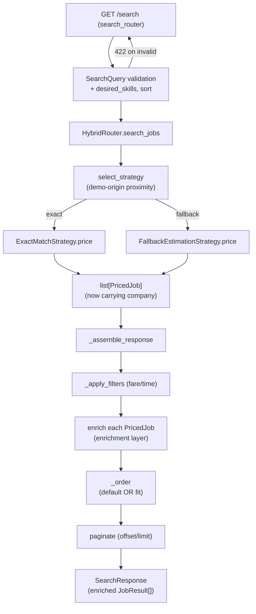
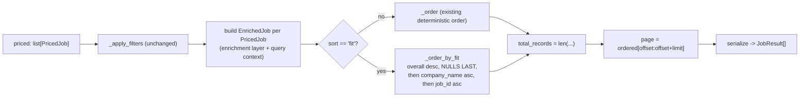

# Design Document

## Overview

This feature enriches the existing `GET /search` endpoint (delivered by the
`hybrid-routing-search` feature) so the Candidate Job Discovery screen can be
fully hydrated from a single call. The change is strictly **additive**: eight new
fields are added to each Job_Result, one optional query parameter (`desired_skills`)
and one optional ordering parameter (`sort`) are accepted, and the top-level
`data`/`meta` envelope plus every pre-existing field is preserved unchanged.

The enrichment is layered on top of the existing pricing pipeline without
disturbing it. The two pricing strategies (`ExactMatchStrategy`,
`FallbackEstimationStrategy`) and the shared orchestrator (`HybridRouter`) keep
computing the same `PricedJob` records they do today. The new work happens in two
places:

1. A new **pure enrichment layer** (`app/services/enrichment.py`) that derives the
   fit scores, work model, commute costs, and transit segments from values already
   present on a `PricedJob` plus the request context.
2. An extension of the **data-access layer** so each priced job also carries its
   company name and coordinates (sourced additively, in the same query that already
   joins `companies`).

The `HybridRouter._assemble_response` pipeline is extended to (a) apply an optional
fit ordering before pagination and (b) serialize the enriched `JobResult`.

### Scope and key constraints

- **Backend only.** SQLAlchemy models, the CSV loader, the request/response
  schemas, the repository query, and the assembly pipeline. Frontend rendering is
  out of scope.
- **Backward compatible.** With `sort` omitted, the result ordering and every
  pre-existing field value are byte-for-byte identical to `hybrid-routing-search`,
  regardless of whether `desired_skills` is supplied (Requirements 1.2, 4.2, 9.5).
- **Nulls, not omissions.** Every added field is always present in the serialized
  record; unavailable inputs yield `null` (Requirement 9.4). Callers MUST NOT
  serialize with `exclude_none=True`.

### Research: source-data findings that shape the design

Three source-data facts were verified against the CSVs and the existing code and
drive explicit design decisions.

- **Company name is present in the source but not in the model.**
  `datasets/company_locations_cleaned_ready.csv` has header
  `ลำดับ,ชื่อนิติบุคคล,ที่ตั้ง,id,cleaned_address,latitude,longitude`. The
  `ชื่อนิติบุคคล` (legal-entity name) column carries the company name, but the
  current `Company` model maps only `id`, `latitude`, `longitude`, `geog`. The model
  and loader must be extended additively to carry a nullable `name`
  (Requirement 5.2).

- **`demo_routes.csv` has no per-leg breakdown.** Its header is
  `origin_station,origin_lat,origin_lng,company_id,exact_fare_thb,exact_time_mins`
  — a single fare and a single duration per route, no leg-level column. The
  Time_Estimation_Service (Google Distance Matrix) likewise returns one duration per
  destination. Therefore **no leg-level transit source exists in the current data**,
  and `transit_segments` resolves to `null` for every result today. The design still
  specifies a leg-level parser and its integration point so that, if `demo_routes.csv`
  gains an optional legs column later, segments populate without further schema
  change; until then the resolver returns `null` (Requirements 6.3, 6.6).

- **`employment_type` values do not map one-to-one onto work models.** The source
  uses values like `Full-time`; the frontend work-model set is
  `On-site`/`Hybrid`/`Remote`. A fixed, case-insensitive mapping dictionary is
  applied with no fallback default (Requirement 8.2, 8.3).

## Architecture

The request path is unchanged in shape; the enrichment is a new pure layer the
orchestrator calls during assembly.



### Layer responsibilities

| Layer | Module | Change |
|-------|--------|--------|
| Transport | `app/api/search.py` | None. `SearchQuery` binding already surfaces new params as query parameters; FastAPI returns 422 automatically. |
| Request schema | `app/schemas/request.py` | Add `desired_skills` and `sort`; add a validator for the token-count limit. |
| Response schema | `app/schemas/response.py` | Add eight fields to `JobResult`; add `CompanyLocation` and `TransitSegment` models. |
| Orchestrator | `app/strategies/router.py` | Enrich before ordering; add fit ordering; serialize enriched result. |
| Pricing strategies | `app/strategies/exact.py`, `fallback.py` | Attach company info to each `PricedJob`. |
| In-memory types | `app/strategies/types.py` | `PricedJob` gains a `company` reference. |
| Enrichment (new) | `app/services/enrichment.py` | Pure derivation functions for all computed fields. |
| Data access | `app/db/repository.py` | `fetch_jobs_for_companies` selects company name/coords too. |
| Model | `app/models/company.py` | Add nullable `name`. |
| Loader | `app/db/loader.py` | Map `ชื่อนิติบุคคล` into `Company.name`. |

The enrichment layer is deliberately **pure and framework-agnostic** (no I/O, no
ORM writes): it takes plain values and the request context and returns plain
values. This keeps the derivation logic independently reasoned about and mirrors
the existing separation between pricing logic and shared assembly.

## Components and Interfaces

### Transport layer — `search_router`

No code change. `SearchQuery` is bound via `Annotated[SearchQuery, Query()]`, so
the two new fields become scalar query parameters and FastAPI returns HTTP 422 with
per-field detail when any constraint (max length, token count, `sort` enum) fails,
before the handler body runs (Requirements 1.4, 1.5, 4.3).

### Request model — `SearchQuery` (extended)

```python
from typing import Literal
from pydantic import BaseModel, Field, field_validator

DESIRED_SKILLS_MAX_LEN = 500
DESIRED_SKILLS_MAX_TOKENS = 50
SortMode = Literal["fit", "default"]

class SearchQuery(BaseModel):
    lat: float = Field(ge=-90, le=90)
    lng: float = Field(ge=-180, le=180)
    max_fare: float | None = Field(default=None, ge=0.01, le=999999.99)
    max_time: int | None = Field(default=None, ge=1, le=1440)
    limit: int = Field(default=50, ge=1, le=200)
    offset: int = Field(default=0, ge=0)
    # Added by this feature
    desired_skills: str | None = Field(default=None, max_length=DESIRED_SKILLS_MAX_LEN)
    sort: SortMode | None = Field(default=None)

    @field_validator("desired_skills")
    @classmethod
    def _validate_token_count(cls, value: str | None) -> str | None:
        if value is None:
            return None
        tokens = normalize_skill_tokens(value)  # from enrichment layer
        if len(tokens) > DESIRED_SKILLS_MAX_TOKENS:
            raise ValueError("too many desired skills supplied")
        return value
```

- `max_length=500` enforces Requirement 1.4 (over-length → 422).
- The `field_validator` enforces Requirement 1.5 (more than 50 normalized tokens →
  422). A raised `ValueError` is surfaced by FastAPI as an HTTP 422 with detail.
- `sort` accepts only `fit` or `default`; any other value is rejected by the
  `Literal` type as HTTP 422 (Requirement 4.3). Omitted (`None`) and `default` both
  mean the pre-existing ordering (Requirement 4.2).

### Enrichment layer — `app/services/enrichment.py` (new)

All functions are pure. Signatures:

```python
def normalize_skill_tokens(raw: str | None) -> list[str]:
    """Split on commas, strip each token, drop empties, lower-case for compare,
    de-duplicate preserving first-seen order. Returns [] for None/blank."""

def compute_skill_fit(desired: list[str], required_skills: str | None) -> int | None:
    """None when desired is empty OR required_skills is null/blank.
    Else round(100 * matched / len(desired)) clamped to 0..100, where matched is
    the count of desired tokens present in the normalized required-skills set."""

def compute_commute_fit(commute_time_mins: int, max_time: int | None) -> int | None:
    """None when max_time is None. Else clamp(round(100 * (max_time - t) / max_time),
    0, 100); 100 when t == 0; 0 when t >= max_time."""

def derive_work_model(employment_type: str | None) -> str | None:
    """Case-insensitive lookup in WORK_MODEL_MAP; None when null/blank/unmapped."""

def per_trip_cost_baht(fare_thb: float) -> int:
    """round-half-to-even of fare_thb, floored at 0 -> non-negative whole baht."""

def monthly_commute_cost_baht(per_trip: int) -> int:
    """per_trip * TRIPS_PER_DAY(2) * WORKING_DAYS_PER_MONTH(22)."""

def overall_fit_score(commute_fit: int | None, skill_fit: int | None) -> float | None:
    """Arithmetic mean of the non-null values; None when both are None."""

def parse_transit_segments(source: str | None) -> list[TransitSegment] | None:
    """Return ordered segments when a well-formed leg-level source is present;
    None when source is absent OR parsing fails (never [] for these cases)."""

WORK_MODEL_MAP = {
    "remote": "Remote",
    "hybrid": "Hybrid",
    "full-time": "On-site",
    "part-time": "On-site",
    "contract": "On-site",
    "internship": "On-site",
    "freelance": "On-site",
}
TRIPS_PER_DAY = 2
WORKING_DAYS_PER_MONTH = 22
```

Rounding note: `per_trip_cost_baht` and the fit scores round to the nearest whole
number. Python's built-in `round` (banker's rounding) is used consistently; the
values are then clamped so no out-of-range or negative value can escape
(Requirements 2.3, 3.2, 7.4).

### Data-access layer — `fetch_jobs_for_companies` (extended)

The existing query already `INNER JOIN`s `companies`. It is extended to also select
the company name and coordinates in the same round trip, so the query budget is
unchanged.

```python
async def fetch_jobs_for_companies(
    db: AsyncSession, company_ids: list[int]
) -> list[JobWithCompany]:
    stmt = (
        select(JobPosting, Company.name, Company.latitude, Company.longitude)
        .join(Company, JobPosting.company_id == Company.id)
        .where(JobPosting.company_id.in_(company_ids))
    )
    ...
    # each row -> JobWithCompany(job=row[0], company_name=row[1],
    #                            company_lat=row[2], company_lng=row[3])
```

Referential integrity is unchanged: the INNER JOIN still excludes jobs whose
`company_id` has no matching company.

### Pricing strategies

`ExactMatchStrategy` and `FallbackEstimationStrategy` are updated only where they
construct `PricedJob`: they now pass the company fields from the `JobWithCompany`
rows returned by `fetch_jobs_for_companies`. No pricing or selection logic changes,
so exact/fallback behavior and the query budget are preserved.

### Orchestrator — `HybridRouter._assemble_response` (extended)

The assembly pipeline gains an enrichment step and a fit-ordering branch:



- **Default path** (`sort` omitted or `default`): `_order` is applied exactly as
  today, and pre-existing field values are untouched, so ordering and values match
  `hybrid-routing-search` regardless of `desired_skills` (Requirements 4.2, 9.5).
- **Fit path** (`sort == "fit"`): results are ordered by `overall_fit_score`
  descending with unavailable (both-null) scores last, ties broken by
  `company_name` ascending (NULLS LAST) then `job_id` ascending — a deterministic
  total order (Requirements 4.4–4.7).
- Pagination is applied **after** ordering in both paths, with `total_records`
  counted before slicing, using the existing `offset`/`limit` semantics
  (Requirements 4.8, 4.9).
- `job_id`-less jobs are excluded during serialization (Requirement 9.6). This is
  applied before pagination counting so `total_records` reflects only returnable
  records.

## Data Models

### Company (extended)

```python
class Company(Base):
    __tablename__ = "companies"
    id: Mapped[int] = mapped_column(primary_key=True)
    name: Mapped[str | None] = mapped_column(nullable=True)  # added; from ชื่อนิติบุคคล
    latitude: Mapped[float] = mapped_column(nullable=False)
    longitude: Mapped[float] = mapped_column(nullable=False)
    geog: Mapped[object] = mapped_column(Geography("POINT", srid=4326), nullable=False, index=True)
```

The loader's `load_companies` maps `row.get("ชื่อนิติบุคคล")` through `_clean_str`
into `name` (empty/whitespace → `None`). No other loader routine changes.

### JobWithCompany (new in-memory type, `app/strategies/types.py`)

```python
@dataclass(frozen=True, slots=True)
class JobWithCompany:
    job: JobPosting
    company_name: str | None
    company_lat: float | None
    company_lng: float | None
```

### PricedJob (extended)

```python
@dataclass(frozen=True, slots=True)
class PricedJob:
    job: JobPosting
    fare_thb: float
    commute_time_mins: int
    is_estimate: bool
    # added
    company_name: str | None = None
    company_lat: float | None = None
    company_lng: float | None = None
```

### Response models (`app/schemas/response.py`, extended)

```python
class CompanyLocation(BaseModel):
    lat: float
    lng: float

class TransitSegment(BaseModel):
    mode: str
    minutes: int = Field(ge=0)

class JobResult(BaseModel):
    # existing fields (unchanged)
    job_id: str | None = None
    company_id: int | None = None
    job_title: str | None = None
    salary: int | None = None
    required_skills: str | None = None
    employment_type: str | None = None
    fare_thb: float
    commute_time_mins: int
    is_estimate: bool
    # added by this feature (always present; null when unavailable)
    skill_fit_score: int | None = None
    commute_fit_score: int | None = None
    company_name: str | None = None
    company_location: CompanyLocation | None = None
    transit_segments: list[TransitSegment] | None = None
    per_trip_cost_baht: int
    monthly_commute_cost_baht: int
    work_model: str | None = None  # "On-site" | "Hybrid" | "Remote" | None
```

`SearchMeta` and `SearchResponse` are unchanged (Requirement 9.1). Models continue
to be serialized without `exclude_none=True` so nulls are emitted, not dropped
(Requirements 2.8, 3.6, 5.1, 6.1, 7.1, 8.1, 9.4).

### Company_Location resolution rule

`company_location` is a `CompanyLocation(lat, lng)` when the associated company is
present and both coordinates are valid and in range
(lat ∈ [-90, 90], lng ∈ [-180, 180]); otherwise `null` (Requirements 5.4, 5.5).
Because the loader already rejects out-of-range coordinates, in practice a loaded
company has valid coordinates; the runtime null-guard remains for defense.

## Correctness Properties

*A property is a characteristic or behavior that should hold true across all valid
executions of a system — essentially, a formal statement about what the system
should do. Properties serve as the bridge between human-readable specifications and
machine-verifiable correctness guarantees.*

The enrichment layer is dominated by pure functions (skill/commute fit, work-model
mapping, cost derivation, token normalization, transit parsing) and pure list
transformations (fit ordering, pagination), which makes property-based reasoning
the right lens for this feature. The following properties are derived from the
prework analysis above.

> **Note on the workspace no-testing policy.** These properties are documented for
> correctness reasoning only. Per the workspace no-testing policy, this feature does
> not add automated property-based or unit tests; verification is by code reading,
> type-checking, and manual reasoning (see Testing Strategy).

### Property 1: Skill-token normalization

*For any* raw `desired_skills` string, `normalize_skill_tokens` yields a list in
which no token is empty, no token has leading or trailing whitespace, every token is
folded for case-insensitive comparison, and comma-only or whitespace-only input
yields the empty list (equivalent to no desired skills).

**Validates: Requirements 1.3, 1.6**

### Property 2: Skill-fit score formula and bounds

*For any* non-empty desired token set and *any* job whose `required_skills` is
non-null and non-blank, the `skill_fit_score` equals
`round(100 * matched / desired_count)` — where `matched` is the count of desired
tokens (case-insensitively, whitespace-trimmed) present in the job's required-skills
set — constrained to a whole number in `[0, 100]`; it is `100` when every desired
token is present and `0` when none are present.

**Validates: Requirements 2.1, 2.2, 2.3, 2.4, 2.5, 2.8**

### Property 3: Skill-fit nullability

*For any* job, the `skill_fit_score` is `null` if and only if there are no desired
tokens or the job's `required_skills` is null/blank; this `null` is distinct from
the value `0` produced when desired tokens are supplied but none match.

**Validates: Requirements 2.6, 2.7**

### Property 4: Commute-fit score formula and bounds

*For any* job with `max_time` provided (`tolerance > 0`), the `commute_fit_score`
equals `clamp(round(100 * (tolerance - commute_time_mins) / tolerance), 0, 100)`; it
is `100` when `commute_time_mins == 0` and `0` when
`commute_time_mins >= tolerance`. The non-null result is always a whole number in
`[0, 100]`.

**Validates: Requirements 3.1, 3.2, 3.3, 3.4, 3.6**

### Property 5: Commute-fit nullability

*For any* result set produced without `max_time`, the `commute_fit_score` is `null`
for every Job_Result regardless of its `commute_time_mins`.

**Validates: Requirements 3.5**

### Property 6: Commute-cost derivation and bounds

*For any* job, `per_trip_cost_baht` equals `fare_thb` rounded to the nearest whole
baht and `monthly_commute_cost_baht` equals `per_trip_cost_baht * 2 * 22`; both
values are non-negative whole numbers.

**Validates: Requirements 7.1, 7.2, 7.3, 7.4**

### Property 7: Work-model mapping

*For any* `employment_type` value, `work_model` equals the case-insensitive
dictionary mapping (`Remote`→Remote, `Hybrid`→Hybrid,
`Full-time`/`Part-time`/`Contract`/`Internship`/`Freelance`→On-site), and is `null`
when the value is null, blank, or not present in the dictionary (no fallback
default). The result is always a member of `{On-site, Hybrid, Remote}` or `null`.

**Validates: Requirements 8.1, 8.2, 8.3, 8.4**

### Property 8: Company name and location resolution

*For any* Job_Result, `company_name` is the loaded company name or `null` when it is
missing, empty, or not loaded; and `company_location` is an object
`{lat, lng}` equal to the company's coordinates when the associated company is
present with both coordinates valid and in range, and `null` otherwise.

**Validates: Requirements 5.1, 5.3, 5.4, 5.5**

### Property 9: Transit-segment resolution and structure

*For any* Job_Result, `transit_segments` is `null` when no leg-level transit source
is available or when parsing the source fails (never an empty list for these cases);
when it is a non-null list, the segments appear in travel order, each carrying a
`mode` string (recognized values passed through as-is and unrecognized values passed
through unchanged, never dropped) and a `minutes` value that is a whole number
greater than or equal to `0`.

**Validates: Requirements 6.1, 6.2, 6.3, 6.5, 6.6, 6.7, 6.8**

### Property 10: Overall-fit derivation

*For any* Job_Result under `sort == "fit"`, the `Overall_Fit_Score` equals the
arithmetic mean of the non-null values among `commute_fit_score` and
`skill_fit_score`, and is unavailable exactly when both are `null`.

**Validates: Requirements 4.4, 4.5**

### Property 11: Fit ordering is a deterministic total order

*For any* list of Job_Results and *any* input permutation of it, ordering under
`sort == "fit"` produces an identical sequence in which records are ordered by
`Overall_Fit_Score` descending, all records with an unavailable `Overall_Fit_Score`
come after all records with an available one, ties are broken by `company_name`
ascending (nulls last), and any remaining ties by `job_id` ascending.

**Validates: Requirements 4.6, 4.7**

### Property 12: Fit pagination

*For any* fit-ordered result set, `total_records` equals the count of records after
ordering and before slicing, and the returned page equals
`ordered[offset : offset + limit]` using the existing pagination semantics
(including the `offset == 0` and `limit` boundary behavior of
`hybrid-routing-search`).

**Validates: Requirements 4.8, 4.9**

### Property 13: Backward compatibility with `sort` omitted

*For any* request with `sort` omitted or set to `default`, whether or not
`desired_skills` is supplied, the Job_Result ordering and the values of all
pre-existing fields (`job_id`, `company_id`, `job_title`, `salary`,
`required_skills`, `employment_type`, `fare_thb`, `commute_time_mins`,
`is_estimate`) are identical to the `hybrid-routing-search` default, and the
top-level `data`/`meta` structure and `meta` fields (`total_records`, `limit`,
`offset`) are unchanged.

**Validates: Requirements 1.2, 4.2, 9.1, 9.2, 9.5**

### Property 14: Additive field presence with null-preservation

*For any* Job_Result, all eight added fields (`skill_fit_score`,
`commute_fit_score`, `company_name`, `company_location`, `transit_segments`,
`per_trip_cost_baht`, `monthly_commute_cost_baht`, `work_model`) are present in the
serialized record rather than omitted, take a `null` value when the input needed to
populate them is unavailable, and no pre-existing field is removed or renamed.

**Validates: Requirements 2.8, 3.6, 5.1, 6.1, 7.1, 8.1, 9.3, 9.4**

### Property 15: Primary-identifier exclusion

*For any* result set, every Job_Posting whose `job_id` is missing or null is
excluded entirely from the response `data` list.

**Validates: Requirements 9.6**

### Property 16: Input validation rejects invalid requests

*For any* request in which `desired_skills` exceeds 500 characters, or normalizes to
more than 50 tokens, or `sort` is a value other than `fit` or `default`, the
Search_Endpoint returns HTTP 422 and performs no search.

**Validates: Requirements 1.4, 1.5, 4.3**

## Error Handling

- **Input validation (HTTP 422).** `desired_skills` length (`max_length=500`) and
  the `sort` enum are enforced by Pydantic `Field`/`Literal` constraints; the
  >50-token limit is enforced by a `field_validator` raising `ValueError`. All three
  surface as FastAPI HTTP 422 with per-field detail before any search runs
  (Requirements 1.4, 1.5, 4.3). This preserves the existing behavior where invalid
  input never reaches the handler body.
- **Time-service failure (HTTP 502).** Unchanged. A `TimeEstimationError` under the
  fallback-selected path still propagates to the route and maps to HTTP 502; under
  exact match it is still handled best-effort. Enrichment runs only on records that
  survived pricing, so it never introduces a new 502 path.
- **Missing company name / coordinates.** Resolved to `null` fields rather than
  errors (Requirements 5.3, 5.5). The INNER JOIN guarantees a company row exists for
  every returned job; a defensive null-guard still applies when coordinates are
  absent or out of range.
- **Absent or malformed transit source.** Resolved to `null` (never an exception,
  never an empty list) so a bad leg-level source degrades gracefully and is
  indistinguishable from "no source" to the client (Requirements 6.6, 6.8).
- **Unmapped / blank `employment_type`.** Resolved to `null` `work_model` with no
  fallback default (Requirements 8.3, 8.4).
- **Missing `job_id`.** Excluded from the response entirely rather than emitted with
  a null identifier (Requirement 9.6).
- **Empty desired-skill set (blank/comma-only).** Treated as "no desired skills" so
  `skill_fit_score` is `null`, matching the omitted case (Requirement 1.6).

## Testing Strategy

This project is governed by a workspace **no-testing policy**: no unit, integration,
or property-based tests are created, modified, or run as part of this feature, and no
test commands are executed. The Correctness Properties above are recorded solely as
a specification of intended behavior to guide implementation and code review.

Verification is performed without automated tests:

- **Type-checking and build.** The backend is validated by importing/compiling the
  changed modules and running the project's type checks so that the extended
  schemas, models, and function signatures are internally consistent.
- **Static reasoning against the properties.** Each pure enrichment function is
  reviewed directly against its property (formula, bounds, nullability), since the
  functions are small and side-effect-free and can be reasoned about by inspection.
- **Loader mapping review (Requirement 5.2).** The `ชื่อนิติบุคคล → Company.name`
  mapping is verified by reading the loader against the CSV header rather than by an
  automated data-load test.
- **Backward-compatibility review (Property 13).** The default-sort path is
  confirmed by reading `_assemble_response` to ensure the existing `_order` and the
  pre-existing field values are untouched when `sort` is omitted.

If the no-testing policy is lifted in the future, these properties are written to be
directly implementable as property-based tests (one test per property, minimum 100
iterations, each tagged `Feature: job-discovery-enrichment, Property {n}: {text}`),
with example-based tests reserved for the endpoint-config criteria (1.1, 4.1, 6.4)
and the loader smoke check (5.2).
