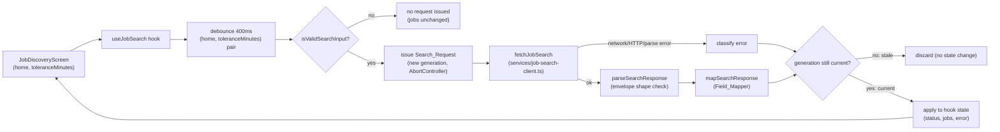
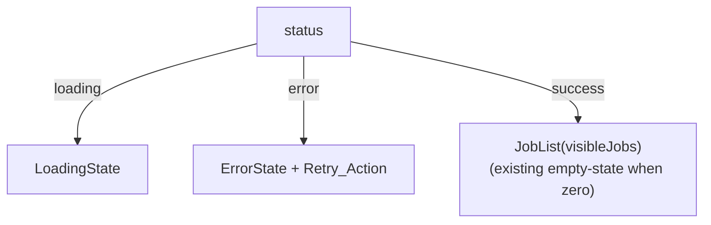

# Design Document

## Overview

This feature wires the existing `JobDiscoveryScreen` to the live `GET /search`
backend endpoint, replacing the hardcoded 23-entry `sampleJobs` array and the
hardcoded `sampleHome` coordinate with a real network round trip. The change is
**frontend-only**: no backend file is modified, and the response contract
(`backend/app/schemas/response.py`) is treated as a fixed, already-shipped
target to map into the existing `Job` view model (`frontend/src/domain/types.ts`).

The screen already owns `toleranceMinutes` (via the Tolerance_Slider) and
receives `home` as a prop; this feature adds a data-fetching layer between
those two existing inputs and the `jobs` the screen renders, plus the
loading/error/empty presentation that a live network call introduces.

### Scope and key constraints (from requirements' key decisions)

- **`max_time` replaces the geometric isochrone gate for exclusion.** The
  pre-existing `filterJobsByCommuteBoundary`/`buildIsochrone` machinery
  (job-discovery-map-first) stays for the *decorative* isochrone overlay only.
  Live jobs are gated by the server (`max_time` query param + its own
  `commute_fit_score` filtering), not by the client-side polygon.
- **No desired-skills input.** `desired_skills` is never sent; `skill_fit_score`
  is `null` for every live job (already a supported `Job.skillFitScore` state).
- **Server-side fit sorting is required.** `sort=fit` is always sent; the
  existing `orderByCommuteFit` client-side sort remains as a secondary,
  viewport-scoped tiebreak layer (unchanged behavior, now operating on
  server-pre-sorted data).
- **Single page, no "load more."** `limit=100`, `offset=0`, fixed constants;
  `meta.total_records` is not surfaced.
- **`home` keeps its existing source** (the screen's `home` prop); no new
  home-selection UI.
- **Nullable backend fields get explicit fallbacks**, never silent exclusion:
  fixed placeholder text for `job_title`/`company_name`, `0` for `salary`, and
  `workModel` extended to accept `null` (Unspecified_Work_Model).

### High-level data flow



## Architecture

### New modules

| Layer | Module | Responsibility |
|-------|--------|-----------------|
| Domain (pure) | `domain/job-result.ts` | TypeScript types mirroring the backend `SearchResponse`/`JobResult` JSON contract. |
| Domain (pure) | `domain/build-search-params.ts` | `isValidSearchInput`, `buildSearchParams`, fixed constants (`limit`, `offset`, `sort`). |
| Domain (pure) | `domain/map-job-result.ts` | The Field_Mapper: `mapJobResult`, `mapSearchResponse`, `mapWorkModel`, placeholder constants. |
| Domain (pure) | `domain/parse-search-response.ts` | `parseSearchResponse` structural-shape validation + `MalformedResponseError`. |
| Service (I/O) | `services/job-search-client.ts` | `fetchJobSearch` — the actual `fetch()` call, HTTP-status/network error classification, `API_BASE_URL`. |
| Hook (orchestration) | `screens/discovery/useJobSearch.ts` | Combines debounce + abort/generation tracking + the above pure/IO pieces into `{ jobs, status, retry }`. |
| Presentational | `screens/discovery/LoadingState.tsx`, `ErrorState.tsx` | Job_List_region Loading_State / Error_State + Retry_Action. |

### Modified modules

| Module | Change |
|--------|--------|
| `domain/types.ts` | `Job.workModel` widened from `WorkModel` to `WorkModel \| null` (Unspecified_Work_Model). |
| `screens/JobDiscoveryScreen.tsx` | Remove `sampleJobs`/`sampleHome` as the data source; wire `useJobSearch(home, toleranceMinutes)`; render Loading_State/Error_State/JobList in the list region based on `status`; drop the `commuteBoundaryJobs` gating pipeline (map pins/list now derive from the live `jobs` directly). |
| `screens/discovery/TransitMap.tsx` | Pins are no longer restricted by `filterJobsByCommuteBoundary`; every job with a valid `location` gets a pin (Requirement 6.1, 6.2, 6.4). The isochrone polygon overlay (`IsochroneOverlay`) is unchanged and keeps rendering from `home`/`toleranceMinutes` alone — it never receives or filters the job list. |
| `domain/index.ts`, `screens/discovery/index.ts` | Barrel exports for the new modules/components. |
| `i18n/keys.ts`, `i18n/strings.ts` | New keys: `discoveryLoading`, `discoveryErrorMessage`, `discoveryRetryAction`, `jobTitleUnavailable`, `companyNameUnavailable`. |

`JobDiscoveryScreenProps` keeps its existing `jobs?`, `home?`,
`initialToleranceMinutes?` shape for backward compatibility (callers that pass
an explicit `jobs` array — none exist today outside the deleted sample data —
still work), but the routed screen (no props) now sources `jobs` from
`useJobSearch` instead of defaulting to `sampleJobs`.

### Why a hook instead of inlining fetch logic in the screen

The debounce timer, `AbortController` lifecycle, and stale-response
generation counter are three independent pieces of state that must stay
consistent with each other on every `home`/`toleranceMinutes` change and on
every retry. Isolating them in `useJobSearch` keeps `JobDiscoveryScreen`'s
existing responsibilities (selection, viewport, map/list composition)
untouched and keeps the new orchestration logic in one reviewable place,
mirroring the existing pattern of screen-scoped hooks colocated under
`screens/discovery/` (e.g. `ViewportWatcher`'s debounced-settle logic).

## Components and Interfaces

### `domain/job-result.ts` (new) — backend response contract

```typescript
export interface CompanyLocationResult {
  lat: number;
  lng: number;
}

export interface TransitSegmentResult {
  mode: string;
  minutes: number;
}

export interface JobResult {
  job_id: string | null;
  company_id: number | null;
  job_title: string | null;
  salary: number | null;
  required_skills: string | null;
  employment_type: string | null;
  fare_thb: number;
  commute_time_mins: number;
  is_estimate: boolean;
  skill_fit_score: number | null;
  commute_fit_score: number | null;
  company_name: string | null;
  company_location: CompanyLocationResult | null;
  transit_segments: TransitSegmentResult[] | null;
  per_trip_cost_baht: number;
  monthly_commute_cost_baht: number;
  work_model: string | null;
}

export interface SearchMeta {
  total_records: number;
  limit: number;
  offset: number;
}

export interface SearchResponse {
  data: JobResult[];
  meta: SearchMeta;
}
```

This is a direct mirror of `backend/app/schemas/response.py`; it intentionally
duplicates rather than imports across the frontend/backend boundary (no shared
package exists in this repo).

### `domain/build-search-params.ts` (new)

```typescript
export const SEARCH_LIMIT = 100;
export const SEARCH_OFFSET = 0;
export const SEARCH_SORT = "fit" as const;
export const SEARCH_DEBOUNCE_MS = 400;

export interface SearchParams {
  lat: number;
  lng: number;
  max_time: number;
  sort: "fit";
  limit: number;
  offset: number;
}

/**
 * True when `home` is a valid, finite coordinate and `toleranceMinutes` is a
 * finite number (Requirement 1.5). Reuses `isValidCoordinate` (geo.ts) so the
 * "finite lat/lng" rule stays defined in exactly one place.
 */
export function isValidSearchInput(
  home: Coordinate | null | undefined,
  toleranceMinutes: number,
): home is Coordinate {
  return isValidCoordinate(home) && Number.isFinite(toleranceMinutes);
}

/**
 * Build the Search_Request query parameters. Callers MUST check
 * `isValidSearchInput` first; this function assumes valid input and performs
 * no clamping/validation of its own (Requirement 1.3, 1.4).
 */
export function buildSearchParams(
  home: Coordinate,
  toleranceMinutes: number,
): SearchParams {
  return {
    lat: home.lat,
    lng: home.lng,
    max_time: toleranceMinutes,
    sort: SEARCH_SORT,
    limit: SEARCH_LIMIT,
    offset: SEARCH_OFFSET,
  };
}
```

### `domain/parse-search-response.ts` (new)

```typescript
export class MalformedResponseError extends Error {
  constructor(message: string) {
    super(message);
    this.name = "MalformedResponseError";
  }
}

/**
 * Validate that `json` has the top-level SearchResponse envelope shape
 * (`data` is an array, `meta` carries numeric total_records/limit/offset).
 * Individual JobResult fields are NOT deep-validated here — they are already
 * all-nullable/permissive by contract, and mapJobResult (Field_Mapper)
 * defensively coalesces every field, so a per-record shape mismatch cannot
 * crash the mapping step. Throws MalformedResponseError when the envelope
 * itself does not match (Requirement 5.2 — "cannot be parsed into the
 * expected shape").
 */
export function parseSearchResponse(json: unknown): SearchResponse {
  if (typeof json !== "object" || json === null) {
    throw new MalformedResponseError("Response body is not an object");
  }
  const obj = json as Record<string, unknown>;
  if (!Array.isArray(obj.data)) {
    throw new MalformedResponseError("Response body is missing a data array");
  }
  const meta = obj.meta as Record<string, unknown> | undefined;
  if (
    typeof meta !== "object" ||
    meta === null ||
    typeof meta.total_records !== "number" ||
    typeof meta.limit !== "number" ||
    typeof meta.offset !== "number"
  ) {
    throw new MalformedResponseError("Response body has an invalid meta object");
  }
  return { data: obj.data as JobResult[], meta: meta as unknown as SearchMeta };
}
```

### `domain/map-job-result.ts` (new) — the Field_Mapper

```typescript
export const WORK_MODEL_LOOKUP: Record<string, WorkModel> = {
  "On-site": "On-site",
  Hybrid: "Hybrid",
  Remote: "Remote",
};

/**
 * Case-sensitive lookup; null or any unrecognized string (including a
 * case-varied match like "on-site") maps to null (Requirement 4.6).
 */
export function mapWorkModel(workModel: string | null): WorkModel | null {
  if (workModel === null) {
    return null;
  }
  return WORK_MODEL_LOOKUP[workModel] ?? null;
}

/**
 * Transform one JobResult into one Job view model (Requirement 4.1-4.8).
 *
 * Deprecated Job fields with no live-data source (`urbanFitScore`,
 * `lifestyleFitScore`, `routeDescription`, `monthlyTravelCostBaht`) are set
 * to deterministic defaults (0 / ""); the Map-First Job_Discovery_Screen
 * never reads them, and no requirement governs their live value.
 */
export function mapJobResult(result: JobResult): Job {
  return {
    id: result.job_id ?? "",
    title: result.job_title ?? resolveText(K.jobTitleUnavailable, strings),
    company: result.company_name ?? resolveText(K.companyNameUnavailable, strings),
    urbanFitScore: 0,
    lifestyleFitScore: 0,
    commutingMinutes: result.commute_time_mins,
    routeDescription: "",
    monthlyTravelCostBaht: 0,
    perTripCostBaht: result.per_trip_cost_baht,
    salaryBaht: result.salary ?? 0,
    monthlyCommuteCostBaht: result.monthly_commute_cost_baht,
    transitSegments: result.transit_segments,
    commuteFitScore: result.commute_fit_score,
    skillFitScore: result.skill_fit_score,
    workModel: mapWorkModel(result.work_model),
    location: result.company_location,
  };
}

/** Maps every JobResult in `response.data`, preserving order (Requirement 4.1). */
export function mapSearchResponse(response: SearchResponse): Job[] {
  return response.data.map(mapJobResult);
}
```

`result.job_id` is nullable in the schema for defense, but the backend's
enrichment layer already excludes job-id-less records before they reach the
client (see `job-discovery-enrichment` design, Property 15); the `?? ""`
fallback here is therefore purely defensive and never expected to trigger in
practice.

### `services/job-search-client.ts` (new) — the Job_Search_Client I/O layer

```typescript
export const API_BASE_URL =
  import.meta.env.VITE_API_BASE_URL ?? "http://localhost:8000";

export class SearchRequestError extends Error {}
export class NetworkError extends SearchRequestError {}
export class HttpStatusError extends SearchRequestError {
  constructor(public readonly status: number) {
    super(`Search request failed with HTTP ${status}`);
  }
}

/**
 * Issue one Search_Request. Rejects with:
 *   - the original `AbortError` (DOMException) when `signal` is aborted —
 *     callers distinguish this from a real failure and treat it as a
 *     Stale_Response, never surfacing it as an Error_State (Req 3.1, 3.2).
 *   - `NetworkError` on a `fetch()`-level failure (e.g. offline).
 *   - `HttpStatusError` on a non-2xx response.
 *   - `MalformedResponseError` (from parseSearchResponse) on an unparseable
 *     or wrong-shaped body.
 */
export async function fetchJobSearch(
  params: SearchParams,
  signal: AbortSignal,
): Promise<SearchResponse> {
  const url = new URL("/search", API_BASE_URL);
  url.searchParams.set("lat", String(params.lat));
  url.searchParams.set("lng", String(params.lng));
  url.searchParams.set("max_time", String(params.max_time));
  url.searchParams.set("sort", params.sort);
  url.searchParams.set("limit", String(params.limit));
  url.searchParams.set("offset", String(params.offset));

  let res: Response;
  try {
    res = await fetch(url.toString(), { signal });
  } catch (err) {
    if (err instanceof DOMException && err.name === "AbortError") {
      throw err;
    }
    throw new NetworkError("Network request failed");
  }

  if (!res.ok) {
    throw new HttpStatusError(res.status);
  }

  let json: unknown;
  try {
    json = await res.json();
  } catch {
    throw new MalformedResponseError("Response body is not valid JSON");
  }

  return parseSearchResponse(json);
}
```

The API base URL is read from `VITE_API_BASE_URL` (a new `frontend/.env.example`
entry defaulting to `http://localhost:8000`, matching the backend's default dev
port), so the deployed URL can be overridden without a code change.

> **Security note.** This introduces the frontend's first outbound network
> call to a configurable base URL. The endpoint itself (`GET /search`) has no
> authentication today (see `backend/app/api/search.py`) — this feature does
> not change that. It is flagged here for visibility since it is now reachable
> from a live UI rather than only from tests/tools.

### `screens/discovery/useJobSearch.ts` (new) — orchestration hook

```typescript
export type SearchStatus = "loading" | "error" | "success";

export interface UseJobSearchResult {
  /** Jobs mapped from the most recent non-stale successful response, or []
   *  before the first success. */
  jobs: Job[];
  /** Derived purely from the latest-generation outcome (Requirement 5). */
  status: SearchStatus;
  /** Re-issues a Search_Request using the current home/toleranceMinutes
   *  (Requirement 5.3). */
  retry: () => void;
}

export function useJobSearch(
  home: Coordinate | null | undefined,
  toleranceMinutes: number,
): UseJobSearchResult;
```

Internal composition (implementation detail, described for the design's data
flow — not part of the public interface):

1. **Debounce.** `home` and `toleranceMinutes` are combined into one
   dependency `[home?.lat, home?.lng, toleranceMinutes]` and passed through a
   single `setTimeout`-based debounce of `SEARCH_DEBOUNCE_MS` (400ms) that
   resets on every change to either value. Because both inputs share one
   timer, a change to both within the window collapses into exactly one
   scheduled evaluation using the latest pair (Requirement 2.1-2.4).
2. **Validation gate.** When the debounce timer fires, `isValidSearchInput`
   is checked. If it fails, no request is issued and existing `jobs`/`status`
   are left untouched (Requirement 1.5-1.7); an internal `retry` re-runs the
   same check.
3. **Generation + abort.** A `useRef` generation counter increments on every
   issued request. Issuing generation *N* calls `.abort()` on generation
   *N-1*'s `AbortController` (if still pending) before starting the new
   `fetch` (Requirement 3.1). `status` is set to `"loading"` synchronously
   when a request is issued.
4. **Apply-on-resolve.** When `fetchJobSearch` settles for generation *N*, the
   hook checks `N === currentGenerationRef.current` before touching state:
   - Not current (a newer request has since been issued) → the response (or
     the `AbortError` from step 3's own abort call) is discarded entirely, no
     state change (Requirement 3.2).
   - Current + success → `status = "success"`, `jobs = mapSearchResponse(...)`.
   - Current + non-abort failure → `status = "error"`, `jobs` unchanged (the
     previously displayed jobs, if any, are not cleared; only the list
     region's render branch changes — see below).
5. **Mount.** The debounce/validation/issue pipeline runs once on mount with
   the initial `home`/`toleranceMinutes`, exactly like any other change
   (Requirement 1.2).

### `JobDiscoveryScreen` list-region rendering (modified)



The map region is unaffected by `status`: `TransitMap` always receives the
current `jobs` (the last successfully mapped set, `[]` before the first
success), independent of whether the list region is currently showing
Loading_State or Error_State. Only three things read `status`: the list-region
branch above; nothing else in the render tree does. This keeps "loading" from
blanking pins that are still valid while a background refetch is in flight,
and matches Requirement 5.1's scope ("...in the job list region").

`visibleJobs` is still `orderByCommuteFit(filterJobsByViewport(jobs, viewportBounds))`
— the same composition as today — except the input is now the live `jobs`
directly (no `filterJobsByCommuteBoundary` gate), per Requirement 6.1.
`isochronePins` for the map is now simply `jobs` (every job with a valid
`location` still gets a pin — enforced inside `TransitMap` via the existing
`partitionJobsByCoordinate`, not by a new boundary filter).

### `TransitMap` pin derivation (modified)

The existing `partitionJobsByCoordinate(jobs)` call already separates
plottable/unplottable jobs. The one line that changes is the pin source:
`isochronePins` no longer passes `plottable` through
`filterJobsByCommuteBoundary(plottable, home, toleranceMinutes)` — it uses
`plottable` directly. `IsochroneOverlay` (the decorative mint polygon) is
untouched: it takes only `home`/`toleranceMinutes`, never a job list, so it
continues to render exactly as before and is structurally incapable of
excluding a job (Requirement 6.4).

### `LoadingState` / `ErrorState` (new, presentational)

```typescript
export function LoadingState(): JSX.Element; // role="status", K.discoveryLoading text
export interface ErrorStateProps {
  onRetry: () => void;
}
export function ErrorState({ onRetry }: ErrorStateProps): JSX.Element; // role="alert", K.discoveryErrorMessage + a Retry_Action button calling onRetry
```

Both follow the existing `JobList` empty-state pattern (a centered message in
the list region) — `LoadingState` uses `role="status"`, `ErrorState` uses
`role="alert"` plus a `<button>` wired to `onRetry` (Requirement 5.3).

## Data Models

### `Job.workModel` (modified, `domain/types.ts`)

```typescript
export type WorkModel = "On-site" | "Hybrid" | "Remote";

export interface Job {
  // ...unchanged fields...
  /** Exactly one work model, or null for Unspecified_Work_Model (Req 4.6). */
  workModel: WorkModel | null;
}
```

This is the only structural change to an existing type. No current renderer
reads `Job.workModel` (verified: no component in `screens/discovery/`
consumes it today), so widening it to `| null` has no other ripple effect in
this codebase; a future feature owns rendering a Work_Model_Tag.

### Backend response contract (new types)

See `domain/job-result.ts` above (`JobResult`, `CompanyLocationResult`,
`TransitSegmentResult`, `SearchMeta`, `SearchResponse`) — a byte-for-byte
mirror of `backend/app/schemas/response.py`.

### Hook state (internal to `useJobSearch`)

```typescript
interface JobSearchState {
  status: SearchStatus; // "loading" | "error" | "success"
  jobs: Job[];
}
```

Backed by a `useRef<number>` generation counter and a
`useRef<AbortController | null>` for the in-flight controller; these are not
part of the public interface.

## Correctness Properties

*A property is a characteristic or behavior that should hold true across all
valid executions of a system — essentially, a formal statement about what the
system should do. Properties serve as the bridge between human-readable
specifications and machine-verifiable correctness guarantees.*

This feature is dominated by pure functions (`buildSearchParams`,
`isValidSearchInput`, `mapJobResult`, `mapSearchResponse`, `mapWorkModel`,
`parseSearchResponse`) plus a small, precisely specifiable stateful
orchestration contract (`useJobSearch`'s debounce/generation behavior), which
makes property-based reasoning the right lens. The following properties are
derived from the prework analysis and consolidated to remove redundancy (e.g.
the field-by-field passthrough checks for `company_location`/`transit_segments`
are subsumed by the general passthrough property rather than restated).

> **Note on the workspace no-testing policy.** These properties are documented
> for correctness reasoning only. Per the workspace no-testing policy, this
> feature does not add automated property-based or unit tests; verification is
> by code reading, type-checking, and manual reasoning (see Testing Strategy).

### Property 1: Search request parameters are a deterministic function of home and tolerance

*For any* valid coordinate `home` and *any* finite `toleranceMinutes`,
`buildSearchParams(home, toleranceMinutes)` returns an object whose `lat`/`lng`
equal `home.lat`/`home.lng`, whose `max_time` equals `toleranceMinutes`, and
whose `sort`, `limit`, and `offset` are always exactly `"fit"`, `100`, and `0`
respectively, regardless of the input values.

**Validates: Requirements 1.2, 1.3, 1.4**

### Property 2: Validation gate controls request issuance

*For any* `home` value (including `null`, `undefined`, and coordinates with a
non-finite `lat`/`lng`) and *any* `toleranceMinutes`, `isValidSearchInput`
returns `true` if and only if `home` is a valid, finite coordinate and
`toleranceMinutes` is finite; and *for any* sequence of `useJobSearch` input
changes in which every intermediate `home` fails this check, no Search_Request
is ever issued for that sequence.

**Validates: Requirements 1.5, 1.6, 1.7**

### Property 3: Debounced input changes coalesce into one request per settled value

*For any* sequence of `(home, toleranceMinutes)` changes arriving faster than
the 400ms Debounce_Window, at most one Search_Request is issued per
"quiet period" (a gap of >= 400ms with no further change), and that request's
parameters always reflect the latest `home` and the latest `toleranceMinutes`
value at the moment the window elapsed — regardless of whether `home`,
`toleranceMinutes`, or both changed during the window.

**Validates: Requirements 2.1, 2.2, 2.3, 2.4**

### Property 4: Only the latest-generation outcome is ever applied

*For any* sequence of issued Search_Requests and *any* order in which their
responses (or abort signals) arrive, the hook's `status`/`jobs` state is
updated only by the outcome whose generation number equals the generation of
the most recently *issued* request at the time that outcome is processed;
every other outcome — including one that resolves successfully after a newer
request was issued — is discarded with no state change, and issuing generation
*N* always aborts generation *N-1*'s controller if it is still pending.

**Validates: Requirements 3.1, 3.2, 3.3**

### Property 5: Field mapping is an order-preserving, field-correct passthrough

*For any* `SearchResponse`, `mapSearchResponse(response).length` equals
`response.data.length`, the mapped job at index *i* corresponds to
`response.data[i]`, and for that pair `job_id`, `commute_time_mins`,
`per_trip_cost_baht`, `monthly_commute_cost_baht`, `skill_fit_score`,
`commute_fit_score`, `transit_segments`, and `company_location` map unchanged
(including `null` passing through as `null`) to `id`, `commutingMinutes`,
`perTripCostBaht`, `monthlyCommuteCostBaht`, `skillFitScore`, `commuteFitScore`,
`transitSegments`, and `location` respectively.

**Validates: Requirements 4.1, 4.2, 4.7, 4.8**

### Property 6: Null title/company fall back to a fixed, non-empty placeholder

*For any* `JobResult`, `mapJobResult(result).title` equals the fixed
job-title-unavailable placeholder if and only if `result.job_title` is `null`
(otherwise it equals `result.job_title` unchanged), and symmetrically
`mapJobResult(result).company` equals the fixed company-name-unavailable
placeholder if and only if `result.company_name` is `null`; both placeholders
are always non-empty strings.

**Validates: Requirements 4.3, 4.4**

### Property 7: Null salary maps to exactly 0, independent of other fields

*For any* `JobResult` whose `salary` is `null`, `mapJobResult(result).salaryBaht`
equals exactly `0`, regardless of the values of every other field on that
`JobResult`.

**Validates: Requirements 4.5**

### Property 8: Work-model mapping is case-sensitive with a null/unrecognized fallback

*For any* string or `null` value `v`, `mapWorkModel(v)` equals `v` unchanged
(as a `WorkModel`) if and only if `v` is exactly `"On-site"`, `"Hybrid"`, or
`"Remote"` (case-sensitive); every other string (including a case-varied match
such as `"on-site"` or `"HYBRID"`) and `null` itself map to `null`.

**Validates: Requirements 4.6**

### Property 9: Exactly one list-region render branch is active, driven solely by status

*For any* `useJobSearch` state, the `JobDiscoveryScreen` list region renders
exactly one of {Loading_State, Error_State, mapped job list} — Loading_State
if and only if `status === "loading"`, Error_State if and only if
`status === "error"`, and the mapped job list (which itself shows the existing
empty-state message when `jobs` is empty) if and only if
`status === "success"`; issuing a new request (via a fresh input change or
Retry_Action) always transitions `status` to `"loading"` first, so an
Error_State from a prior failure can never co-render with a subsequent
in-flight request.

**Validates: Requirements 5.1, 5.2, 5.4, 5.5, 5.6**

### Property 10: Map pins are viewport-independent; only the list is viewport-restricted

*For any* array of mapped jobs and *any* map viewport bounds (including
`null`, before the first settle), the map-pins set equals every job in that
array with a non-null, valid `location` — unaffected by the viewport bounds —
while the list set equals `orderByCommuteFit(filterJobsByViewport(jobs, bounds))`,
so the pins set and the list set can differ only by viewport containment,
never by any commute-boundary-derived exclusion.

**Validates: Requirements 6.1, 6.2, 6.3, 6.4**

## Error Handling

- **Network failure.** `fetch()` rejecting for a reason other than the
  request's own abort is wrapped as `NetworkError` and, if it belongs to the
  current generation, surfaces as Error_State (Requirement 5.2).
- **Non-2xx HTTP status.** Any `res.ok === false` response (e.g. the existing
  backend HTTP 422 on invalid query params, or HTTP 502 when the Time
  Estimation Service is unavailable — see `backend/app/api/search.py`) is
  wrapped as `HttpStatusError` and surfaces as Error_State the same way. This
  feature always sends already-valid parameters (clamped tolerance, a
  finite-checked coordinate, fixed `limit`/`offset`/`sort`), so a 422 is not
  expected in practice but is still handled uniformly as any other failure.
- **Unparseable / wrong-shaped body.** A non-JSON body or a JSON body missing
  the `data` array / valid `meta` object is rejected by `parseSearchResponse`
  as `MalformedResponseError` and surfaces as Error_State (Requirement 5.2).
  Malformed individual `JobResult` records (rather than a malformed envelope)
  are handled defensively by `mapJobResult`'s `??` fallbacks instead of
  rejecting the whole response, since every `JobResult` field is already
  nullable by contract.
- **Abort of a superseded request.** The `AbortError` thrown by `fetch()` when
  its own `AbortController.abort()` fires is expected and is never treated as
  a failure — it is filtered out before generation-currency is even checked,
  so it can never produce an Error_State (Requirement 3.1, 3.2).
- **Stale non-abort outcomes.** A response or error that resolves for a
  generation that is no longer the latest is discarded silently (no
  Error_State, no jobs update) — see Property 4.
- **Invalid/unset `home`.** No request is issued at all; the list region falls
  back to the existing `JobList` empty-state (since `jobs` is simply `[]` until
  a first success), and the map's existing `home`-not-set overlay is
  untouched (Requirement 1.6, 1.7).
- **Retry.** Activating Retry_Action re-runs the same debounce→validate→issue
  pipeline with the current `home`/`toleranceMinutes` (bypassing the 400ms
  wait, since it is a direct user action rather than an input change),
  immediately transitioning `status` to `"loading"` and clearing any prior
  Error_State (Requirement 5.3, 5.4).

## Testing Strategy

This project is governed by a workspace **no-testing policy**: no unit,
integration, or property-based tests are created, modified, or run as part of
this feature, and no test commands are executed. The Correctness Properties
above are recorded solely as a specification of intended behavior to guide
implementation and code review.

Verification is performed without automated tests:

- **Type-checking and build.** `tsc -b` (the existing `npm run build` step) is
  run after implementation so the new modules, the widened `Job.workModel`
  type, and every call site touching it are internally consistent.
- **Static reasoning against the properties.** Each pure function
  (`buildSearchParams`, `isValidSearchInput`, `mapJobResult`,
  `mapSearchResponse`, `mapWorkModel`, `parseSearchResponse`) is small and
  side-effect-free, so it is reviewed directly against its property by
  inspection (formula, passthrough, fallback, bounds).
- **Manual contract check against the backend.** `domain/job-result.ts` is
  compared field-by-field against `backend/app/schemas/response.py` to confirm
  the mirrored contract stays accurate (Requirement 4.2).
- **Hook behavior review (Properties 3, 4, 9).** `useJobSearch`'s debounce,
  generation-counter, and status-derivation logic is reviewed by reading the
  effect/ref wiring end to end, tracing through the specific interleavings
  called out in Properties 3 and 4 (simultaneous home+tolerance changes;
  out-of-order response arrival) by hand.
- **Manual exercise via the running app.** Since this is a UI-facing feature,
  running the Vite dev server and the FastAPI backend locally and observing
  the Network tab (request params, abort-on-supersede, retry behavior) and the
  rendered Loading/Error/empty/populated states is the practical complement to
  the static review above.

If the no-testing policy is lifted in the future, these properties are written
to be directly implementable as property-based tests (one test per property,
minimum 100 iterations, each tagged
`Feature: job-discovery-live-search, Property {n}: {text}`), with
example-based tests reserved for the Retry_Action wiring (5.3) and the
TransitMap pin-rendering wiring (6.1, 6.4).
