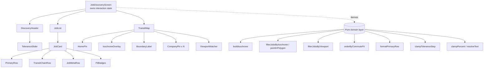
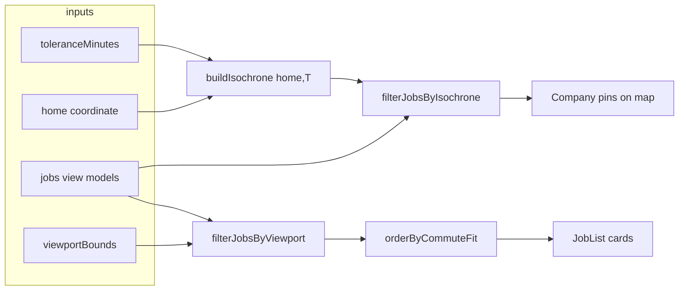

# Design Document

## Overview

This design refactors the existing Job Discovery screen (`JobDiscoveryScreen`) from a list-primary layout into a **Map-First** interface that enforces the "20-Minute City" concept. The map becomes the dominant region (~65% width) and the job list becomes a supporting panel (~35% width) with re-engineered cards that lead with commute metrics.

The refactor is intentionally scoped to **frontend rendering and interaction only**. All scores, commute times, transit chains, per-trip costs, and coordinates arrive as view models. Where the design references an isochrone boundary, that boundary is **derived on the frontend from provided inputs** (the home coordinate plus the current tolerance) using a deterministic approximation — no real routing or backend computation is introduced.

The work reuses the project's established patterns:

- A **pure domain layer** (`src/domain/*`) of framework-free functions that are unit- and property-testable in isolation (e.g. `orderJobs`, `filterByTolerance`, `clampPercent`, `resolveText`). New pure helpers are added here.
- **Presentational React components** under `src/screens/discovery/*` that own no business logic and render domain outputs.
- **Thai-first i18n** via `resolveText` + the `T` component, with a guaranteed non-empty fallback (`DEFAULT_FALLBACK_TEXT`).
- **Leaflet via react-leaflet** for map rendering, with plain-DOM sibling overlays so labels/messages remain queryable regardless of the map engine.
- **Tailwind design tokens** from `tailwind.config.ts` (`primary` = `#4edea3`, dark surfaces, `on-surface-variant` muted gray, `space-*` spacing).

### Key behavioral changes

1. **Header** reframed around a 20-minute commute (new Thai title/subtitle), slider defaults to **20 minutes** with a mint-green glow on the target indicator when the value is exactly 20.
2. **Job cards** restructured into four rows: `Primary_Row` (commute time + per-trip cost), `Transit_Chain_Row` (walk/BTS/MRT timeline), `Job_Meta_Row` (demoted title/company), and `Fit_Badges` (two pills replacing the single fit ring).
3. **Map panel** gains a `Home_Pin`, a mint-green `Isochrone_Overlay` scaled to the tolerance, an on-map `Boundary_Label`, and job pins filtered to only those inside the boundary.
4. **Viewport sync**: panning/dragging/zooming re-filters the job list to jobs visible in the current map bounds, re-ordered by descending Commute Fit.

## Architecture

### High-level structure



### State ownership and data flow

`JobDiscoveryScreen` remains the single owner of interaction state:

| State | Type | Purpose | Requirements |
|-------|------|---------|--------------|
| `toleranceMinutes` | `number` | Selected max commute (default **20**, 15–120 step 5) | 2.2, 2.4, 7.4 |
| `selectedJobId` | `string \| null` | Single selected job (map/list highlight sync) | existing |
| `viewportBounds` | `MapBounds \| null` | Current settled map viewport bounds | 9.1 |

The screen derives everything else, keeping components presentational. Two distinct filtering pipelines run in parallel because the requirements assign them different sources:

- **Map pins** are filtered by the **isochrone** (Req 8): `filterJobsByIsochrone(jobs, isochrone)`.
- **List cards** are filtered by the **viewport bounds** (Req 9), then ordered by Commute Fit: `orderByCommuteFit(filterJobsByViewport(jobs, viewportBounds))`.



When the tolerance changes, the isochrone is rebuilt synchronously in a `useMemo`, so pins re-evaluate within the same render (well inside the 500 ms / 1 s budgets in Req 7.4 / 8.4). When the map viewport settles after a pan/zoom, a debounced handler updates `viewportBounds`, re-deriving the list (Req 9.1).

### Isochrone model (frontend approximation)

Because real routing/isochrone computation is out of scope, the frontend derives the boundary deterministically from the home coordinate and the tolerance. `buildIsochrone(home, toleranceMinutes)` returns a closed polygon ring (array of `Coordinate`) whose spatial extent scales linearly with the tolerance. This gives a stable, testable "reachable region" that visibly grows/shrinks as the slider moves (Req 7.3, 7.4) and provides a concrete polygon for point-in-polygon pin filtering (Req 8). The approximation is isolated behind one function so a real isochrone source can replace it later without touching the rendering or filtering code.

### Rendering safety (Leaflet + jsdom)

Following the existing `TransitMap` conventions, all textual overlays (`Boundary_Label`, home-not-set message, empty-state) render as **plain-DOM siblings** of the Leaflet container so they remain present and queryable even when the map engine is mocked. Point-in-polygon filtering and ordering live in the pure domain layer (no Leaflet import) so they are testable without rendering a map.

## Components and Interfaces

### Domain layer (new pure functions, `src/domain/`)

```ts
// transit.ts
export type TransitMode = "Walk" | "BTS" | "MRT";
export interface TransitSegment {
  /** Transport mode; unknown strings fall back to a default icon (Req 5.7). */
  mode: TransitMode | string;
  /** Non-negative whole minutes (0..999) for this leg. */
  minutes: number;
}

// format-primary-row.ts
/** "15 นาที • ฿45 / เที่ยว"; null minutes -> commute-unavailable indicator (Req 4.2/4.4/4.5). */
export function formatPrimaryRow(commuteMinutes: number | null, perTripCostBaht: number): string;

// geo.ts
export interface Coordinate { lat: number; lng: number; }        // reused from types.ts
export type Polygon = Coordinate[];                               // closed ring
export interface MapBounds { south: number; west: number; north: number; east: number; }

/** Ray-casting point-in-polygon; on-edge counts as inside (Req 8.1). */
export function pointInPolygon(point: Coordinate, polygon: Polygon): boolean;

/** Deterministic isochrone ring scaled by tolerance (frontend approximation). */
export function buildIsochrone(home: Coordinate, toleranceMinutes: number): Polygon;

/** True when both lat & lng are finite. */
export function isValidCoordinate(c: Coordinate | null | undefined): c is Coordinate;

/** True when a finite coordinate lies within bounds, inclusive of edges (Req 9.1/9.2). */
export function isWithinBounds(c: Coordinate, bounds: MapBounds): boolean;

// filter-by-isochrone.ts
/** Jobs whose valid company coordinate is inside the isochrone (Req 8.1–8.3). */
export function filterJobsByIsochrone(jobs: Job[], isochrone: Polygon): Job[];

// filter-by-viewport.ts
/** Jobs whose valid company coordinate is within the viewport bounds (Req 9.1–9.3). */
export function filterJobsByViewport(jobs: Job[], bounds: MapBounds): Job[];

// order-by-commute-fit.ts
/** Descending commuteFitScore, ties broken by company A→Z (Req 9.5). */
export function orderByCommuteFit(jobs: Job[]): Job[];

// clamp-tolerance.ts
export const TOLERANCE_MIN = 15;
export const TOLERANCE_MAX = 120;
export const TOLERANCE_STEP = 5;
export const TOLERANCE_TARGET = 20;
/** Snap to nearest valid 5-minute step within [15,120] (Req 2.8). */
export function clampToleranceStep(value: number): number;
```

`clampPercent` (existing) is reused for both fit badges (Req 6.3/6.4). `resolveText` (existing) backs all Thai text (Req 10).

### Presentational components (`src/screens/discovery/`)

| Component | Responsibility | Requirements |
|-----------|----------------|--------------|
| `DiscoveryHeader` (edit) | Render new Thai title + subtitle, host `ToleranceSlider` | 1.1–1.5, 3.3 |
| `ToleranceSlider` (edit) | Label with colon, value + "นาที", default 20, mint glow on target indicator only at 20 | 2.1–2.8 |
| `JobCard` (rewrite) | Compose `PrimaryRow`, `TransitChainRow`, `JobMetaRow`, `FitBadges`; no unified fit ring | 4.x, 5.x, 6.x |
| `PrimaryRow` (new) | Large white commute time + per-trip cost | 4.1–4.5 |
| `TransitChainRow` (new) | Horizontal segment timeline with N−1 connectors, per-mode icons | 5.1–5.7 |
| `JobMetaRow` (new) | Muted title + company | 6.1 |
| `FitBadges` (new) | `Commute_Fit_Badge` (mint fill) left of `Skill_Fit_Badge` (bordered) | 6.2–6.7 |
| `TransitMap` (edit) | Home pin, isochrone overlay, boundary label, isochrone-filtered pins, viewport watcher | 7.x, 8.x, 9.1 |
| `HomePin` (new) | Marker at home coordinate; omitted when invalid | 7.1, 7.2 |
| `IsochroneOverlay` (new) | Mint polygon (fill opacity 0.2–0.5) from `buildIsochrone` | 7.3, 7.4 |
| `BoundaryLabel` (new) | Floating Thai label anchored on the shaded area | 7.5 |
| `ViewportWatcher` (new) | `useMapEvents` moveend/zoomend → debounced bounds callback | 9.1 |
| `JobList` (reuse) | Renders ordered/filtered cards or empty-state | 8.5, 9.4 |

Component prop contracts (selected):

```ts
export interface PrimaryRowProps { commuteMinutes: number | null; perTripCostBaht: number; }

export interface TransitChainRowProps { segments: TransitSegment[] | null; }

export interface FitBadgesProps {
  commuteFitScore: number | null;  // null -> fit-unavailable indicator (Req 6.6)
  skillFitScore: number | null;    // null -> fit-unavailable indicator (Req 6.7)
}

export interface IsochroneOverlayProps { home: Coordinate; toleranceMinutes: number; }

export interface HomePinProps { home: Coordinate | null; }

export interface ViewportWatcherProps { onSettle: (bounds: MapBounds) => void; debounceMs?: number; }

export interface TransitMapProps {
  jobs: Job[];                      // isochrone-filtered pins derive internally
  home: Coordinate | null;
  toleranceMinutes: number;
  selectedJobId: string | null;
  onSelect: (id: string) => void;
  onViewportSettle: (bounds: MapBounds) => void;
}
```

### Layout

At `>=1024px` the split uses a CSS grid with explicit 35/65 tracks (`lg:grid-cols-[35fr_65fr]`), replacing the current 50/50 `lg:grid-cols-2`. Below 1024px it collapses to a single stacked column with the list above the map (`grid-cols-1`), and `overflow-x-hidden` prevents horizontal scrolling (Req 3.1, 3.2). All three regions use dark-mode surface tokens (Req 3.3).

### New i18n keys

Added to `src/i18n/keys.ts` and `src/i18n/strings.ts` (Thai + non-empty default):

| Key | Thai (`th`) | Default |
|-----|-------------|---------|
| `discoveryMapTitle` | หางานใกล้บ้านภายใน 20 นาที | Find jobs within a 20-minute commute |
| `discoveryMapSubtitle` | เพื่อคุณภาพชีวิตที่ดียิ่งขึ้น | For a better quality of life |
| `perTripUnit` | เที่ยว | trip |
| `commuteFitLabel` | ความเหมาะสมด้านการเดินทาง | Commute Fit |
| `skillFitLabel` | ความเหมาะสมด้านทักษะ | Skill Fit |
| `fitUnavailable` | ไม่มีข้อมูล | N/A |
| `isochroneBoundaryLabel` | ขอบเขตเดินทาง 20 นาที | 20-minute reachable area |
| `homeNotSet` | ยังไม่ได้ตั้งค่าตำแหน่งบ้าน | Home location is not set |
| `transitModeWalk` | เดิน | Walk |
| `transitModeBts` | BTS | BTS |
| `transitModeMrt` | MRT | MRT |

The tolerance label reuses `toleranceLabel`; the required trailing colon (Req 2.1) is produced by the existing label + ":" composition in `ToleranceSlider`.

## Data Models

### Extended `Job` view model

The current `Job` type is extended with the map-first fields. Existing fields are retained for backward compatibility with other screens; the discovery screen reads the new fields.

```ts
export interface Job {
  id: string;
  title: string;                          // demoted meta (Req 6.1), <=120 chars
  company: string;                        // demoted meta + A→Z tiebreak (Req 6.1, 9.5)

  // Map-first metrics
  commutingMinutes: number | null;        // whole minutes 0..999; null = unavailable (Req 4.1, 4.5)
  perTripCostBaht: number;                // whole baht 0..999,999 (Req 4.1, 4.2)
  transitSegments: TransitSegment[] | null; // ordered legs; null/empty = unavailable (Req 5.1, 5.6)
  commuteFitScore: number | null;         // 0..100; null = unavailable (Req 6.3, 6.6)
  skillFitScore: number | null;           // 0..100; null = unavailable (Req 6.4, 6.7)
  location: Coordinate | null;            // company coordinate; null = not plottable (Req 8.3)

  workModel: WorkModel;                    // retained (other screens)
  // Deprecated for discovery (kept during migration): urbanFitScore,
  // lifestyleFitScore, routeDescription, monthlyTravelCostBaht
}
```

### Supporting types

```ts
export type TransitMode = "Walk" | "BTS" | "MRT";
export interface TransitSegment { mode: TransitMode | string; minutes: number; }

export interface Coordinate { lat: number; lng: number; } // existing
export type Polygon = Coordinate[];
export interface MapBounds { south: number; west: number; north: number; east: number; }
```

### Screen props

```ts
export interface JobDiscoveryScreenProps {
  jobs?: Job[];
  /** Candidate home/residence coordinate; null/invalid -> home-not-set state (Req 7.2). */
  home?: Coordinate | null;
  /** Initial tolerance; defaults to TOLERANCE_TARGET (20). Restored values are clamped (Req 2.8). */
  initialToleranceMinutes?: number;
}
```

### Transit mode → icon mapping (Material Symbols Outlined, Req 5.5/5.7)

| Mode | Icon `name` |
|------|-------------|
| `Walk` | `directions_walk` |
| `BTS` | `tram` |
| `MRT` | `subway` |
| unknown | `directions_transit` (default) |

The mapping is a `Record<TransitMode, string>` with a default constant, applied consistently across all cards.

## Correctness Properties

*A property is a characteristic or behavior that should hold true across all valid executions of a system — essentially, a formal statement about what the system should do. Properties serve as the bridge between human-readable specifications and machine-verifiable correctness guarantees.*

The properties below were derived from the acceptance-criteria prework and consolidated to remove redundancy (e.g. the five Requirement 10 clauses plus 1.5 all describe one i18n contract; the isochrone/viewport filtering clauses each collapse into a single "exactly this set" property). Each property targets pure domain logic so it can be exercised with a property-based testing library without rendering Leaflet.

### Property 1: Tolerance clamps to the nearest valid step

*For any* real number input, `clampToleranceStep` returns a value that is within the inclusive range 15–120, is an exact multiple of 5, and is the nearest such valid step to the input; applying it again to its own result yields the same value (idempotent).

**Validates: Requirements 2.8**

### Property 2: Tolerance value display format

*For any* valid tolerance value, the displayed text equals the whole-number value, followed by exactly one space, followed by the Thai minutes unit "นาที".

**Validates: Requirements 2.3**

### Property 3: Mint glow appears if and only if the tolerance is 20

*For any* valid tolerance value, the Tolerance_Target_Indicator carries the mint-green glow accent when the value equals 20 and does not carry it for any other value.

**Validates: Requirements 2.5, 2.7**

### Property 4: Primary row commute/cost format

*For any* non-negative whole-minute commute time and any non-negative whole-baht per-trip cost, `formatPrimaryRow` produces exactly the pattern "{minutes} นาที • ฿{cost} / เที่ยว" (including the padded bullet separator), and a zero cost renders as "฿0 / เที่ยว".

**Validates: Requirements 4.1, 4.2, 4.4**

### Property 5: Commute-unavailable rendering

*For any* job whose commuting time is null, the Primary_Row renders the commute-unavailable indicator and never renders a numeric minute value.

**Validates: Requirements 4.5**

### Property 6: Transit chain preserves order and connector count

*For any* transit-segment list of length N where 1 ≤ N ≤ 10, the Transit_Chain_Row renders the segments left-to-right in their original order and renders exactly N−1 connectors between them.

**Validates: Requirements 5.1, 5.3, 5.4**

### Property 7: Every segment renders its duration and unit

*For any* transit-segment list, each rendered segment displays its whole-minute duration followed by the Thai minutes unit "นาที" together with a transport-mode icon.

**Validates: Requirements 5.2**

### Property 8: Transit mode maps to a stable, distinct icon

*For any* two segments sharing the same mode, they resolve to the same Material Symbols icon; the three known modes (Walk, BTS, MRT) resolve to three distinct icons; and any mode outside that set resolves to the single default transit icon while the segment still shows its duration and unit.

**Validates: Requirements 5.5, 5.7**

### Property 9: Empty transit chain shows the unavailable indicator

*For any* job whose transit-segment list is null or empty, the Transit_Chain_Row renders only the commute-unavailable indicator with zero segments, connectors, or icons.

**Validates: Requirements 5.6**

### Property 10: Fit badges display clamped, rounded scores

*For any* numeric commute-fit or skill-fit score, the corresponding badge displays `clampPercent(score)` — a whole number in the inclusive range 0–100 — and for a null/undefined score displays the fit-unavailable indicator instead of a percentage.

**Validates: Requirements 6.3, 6.4, 6.6, 6.7**

### Property 11: Isochrone grows monotonically with tolerance

*For any* home coordinate and any two tolerance values t1 < t2 within 15–120, the polygon from `buildIsochrone(home, t2)` fully encloses the polygon from `buildIsochrone(home, t1)` (every point inside the smaller boundary is inside the larger one).

**Validates: Requirements 7.3, 7.4**

### Property 12: Pins are exactly the jobs inside the isochrone

*For any* job list, home coordinate, and tolerance, the set of rendered Company_Pins equals exactly the set of jobs whose company coordinate is a valid finite pair lying inside or on the edge of `buildIsochrone(home, tolerance)`; jobs outside the boundary and jobs with null/non-finite coordinates are excluded and never counted as inside.

**Validates: Requirements 8.1, 8.2, 8.3, 8.4**

### Property 13: List is exactly the jobs within the viewport bounds

*For any* job list and viewport bounds, `filterJobsByViewport` returns exactly the jobs whose company coordinate is a valid finite pair lying within the bounds inclusive of the boundary edges; jobs strictly outside and jobs with invalid coordinates are excluded.

**Validates: Requirements 9.1, 9.2, 9.3**

### Property 14: Viewport-filtered list ordering

*For any* job list, `orderByCommuteFit` returns a permutation of the input ordered by descending Commute_Fit_Score with ties broken by company name in ascending A-to-Z order; the ordering is total and deterministic.

**Validates: Requirements 9.5**

### Property 15: Thai-first i18n resolution never yields an empty string or raw key

*For any* translation key and string table, `resolveText` returns exactly one non-empty string (containing at least one non-whitespace character) that is: the entry's Thai string when it has non-whitespace content; otherwise the entry's non-empty default; otherwise the guaranteed global fallback text. It never returns the raw key and never returns an empty value.

**Validates: Requirements 1.5, 10.1, 10.2, 10.3, 10.4, 10.5**

## Error Handling

The screen only renders provided view models, so error handling centers on missing, malformed, or out-of-range inputs. Each case degrades gracefully without crashing the map or collapsing the layout.

| Condition | Handling | Requirements |
|-----------|----------|--------------|
| Restored tolerance out of range / not a multiple of 5 | `clampToleranceStep` snaps to nearest valid step before use | 2.8 |
| Commute time null | Primary_Row shows commute-unavailable indicator | 4.5 |
| Transit segments null/empty | Transit_Chain_Row shows commute-unavailable indicator | 5.6 |
| Unknown transit mode | Default transit icon; duration + unit still rendered | 5.7 |
| Commute/skill fit score null/undefined | Badge shows fit-unavailable indicator | 6.6, 6.7 |
| Home coordinate invalid/unavailable | Omit Home_Pin + Isochrone_Overlay; show home-not-set message; map still renders | 7.2 |
| Company coordinate null/non-finite | Omit pin; exclude from isochrone and viewport results | 8.3, 9.3 |
| No jobs inside isochrone | No pins; list empty-state message | 8.5 |
| No jobs within viewport bounds | Zero cards; list empty-state message | 9.4 |
| i18n key missing or blank Thai + blank default | `resolveText` returns the non-empty global fallback (never the raw key) | 1.5, 10.4 |

Defensive practices: `pointInPolygon`, `isWithinBounds`, and the filters guard coordinate validity with `Number.isFinite` before any geometric comparison, so `NaN`/`Infinity`/null never leak into a "match". Pure functions return new arrays and never mutate inputs, matching the existing `orderJobs`/`filterByTolerance` conventions.

## Testing Strategy

### Dual approach

- **Property-based tests** verify the universal properties above across many generated inputs (pure domain logic: formatting, clamping, geometry, filtering, ordering, i18n resolution).
- **Unit / component tests** verify specific examples, layout, styling tokens, exact Thai strings, and rendering branches (the EXAMPLE / SMOKE criteria from prework such as 1.1–1.4, 2.1/2.2/2.4/2.6, 3.x, 6.1/6.2/6.5, 7.1/7.3/7.5/7.6).

### Tooling to add

The project currently ships no test runner (`package.json` has no test dependencies). This design specifies adding, aligned with the Vite/React/TypeScript stack:

- **Vitest** as the test runner (Vite-native) with **jsdom** environment.
- **@testing-library/react** + **@testing-library/jest-dom** for component tests.
- **fast-check** as the property-based testing library (do not hand-roll PBT).

Component tests mock `react-leaflet` (`MapContainer`/`TileLayer`/`Marker`/`Popup`/`Polyline`/`Polygon` → lightweight divs) exactly as the existing `TransitMap` comments describe, so pins, the isochrone, the boundary label, and overlays stay assertable in jsdom.

### Property test configuration

- Each of the 15 properties above is implemented as a **single** fast-check property with a **minimum of 100 iterations** (`fc.assert(fc.property(...), { numRuns: 100 })`).
- Each property test is tagged with a comment referencing the design property, in the format:
  `// Feature: job-discovery-map-first, Property {number}: {property_text}`
- Generators cover edge cases inline (e.g. cost = 0 for Property 4; N = 1 for Property 6; on-edge coordinates for Properties 12–13; blank/whitespace Thai and absent keys for Property 15; unknown mode strings for Property 8).

### Representative unit/example tests

- Exact Thai title/subtitle text and title-above-subtitle order (Req 1.1–1.3).
- Slider label text, default value 20, `min/max/step`, immediate value update (Req 2.1, 2.2, 2.4, 2.6).
- Desktop 35/65 split and stacked mobile layout with no horizontal scroll (Req 3.1, 3.2); dark surface tokens (Req 3.3).
- Primary_Row typography strictly larger/bolder than Job_Meta_Row (Req 4.3); meta muted styling (Req 6.1).
- Two badges present with Commute left of Skill; mint fill vs bordered no-fill; WCAG AA contrast ≥ 4.5:1 for the mint/text pair; no unified fit ring present (Req 6.2, 6.3, 6.4, 6.5).
- Home pin present for valid home; isochrone mint polygon with fill opacity in [0.2, 0.5]; boundary label exact Thai text; Leaflet in use (Req 7.1, 7.3, 7.5, 7.6).
- Empty-state message when no pins/cards (Req 8.5, 9.4).

### Non-PBT rationale (per criterion)

Layout, exact-string, styling, and "map is built on Leaflet" criteria are example/smoke tests — their behavior does not vary meaningfully with generated input, so 100 iterations add no value over a few explicit cases. All input-varying logic (geometry, filtering, ordering, formatting, clamping, i18n) is covered by the property tests above.
