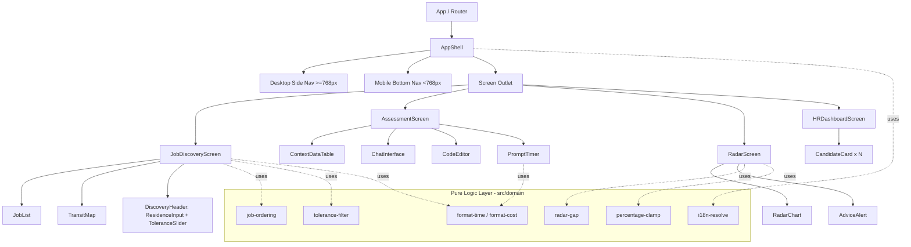

# Design Document

## Overview

UrbanFit Jobs (BKK UrbanTalent Match) is a dark-mode, data-driven Tech talent matching platform for Bangkok. This design covers the **frontend only**: the presentation layer, layout, visual components, and client-side interactions for four core screens plus the shared navigation shell and design system.

The frontend is a single-page application. It receives all domain data (jobs, scores, commuting times, radar series, shortlisted candidates, chat/assessment state) as pre-computed **view models**. All backend concerns — scoring algorithms, AI model behavior, route computation, persistence — are out of scope. The frontend's responsibility is to render these view models faithfully, apply client-side ordering/filtering/formatting rules, and handle local interaction state.

### Technology Choices

| Concern | Choice | Rationale |
|---|---|---|
| Framework | React 18 + TypeScript | Component model fits the four-screen + shared-shell structure; TypeScript gives strong view-model typing and makes the pure logic layer testable. |
| Build tool | Vite | Fast dev server and simple config; first-class TS + React support. |
| Styling | Tailwind CSS (with the design-token config from the reference) | The reference HTML already targets Tailwind with the exact color/spacing/typography tokens; reusing it guarantees visual fidelity. |
| Routing | React Router | Client-side navigation between the four screens with an active-route indicator, matching Requirement 2. |
| Map | Leaflet.js (react-leaflet) | Named in Requirement 5.10; supports tile layers, vector overlays (polylines for BTS/MRT/BRT), markers, and gesture handling. |
| Charts | Chart.js (radar chart type) | Supports multi-series radar with per-series color/line styling required by Requirement 10. |
| Fonts / Icons | Be Vietnam Pro (Google Fonts), Material Symbols Outlined | Mandated by Requirements 1.2 and 1.4. |
| i18n | Thai-first string table with default-text fallback | Supports Requirements 1.8 and 1.9. |
| Testing | Vitest + React Testing Library + fast-check | Vitest integrates with Vite; fast-check provides property-based testing for the pure logic layer. |

### Design Principles

1. **Separation of pure logic from rendering.** Ordering, filtering, formatting, and gap computation live in pure, dependency-free functions (`src/domain/`). These are the primary target for property-based tests and keep components thin.
2. **View-model-driven components.** Components accept typed view models and emit interaction callbacks; they hold only local UI state (selection, input text, timer ticks).
3. **Token-first styling.** All color/spacing/typography come from the Tailwind token config derived from the reference `DESIGN.md`. No hard-coded hex values in components except through tokens.
4. **Graceful degradation.** Missing data (no coordinate, no series, unavailable score, missing translation) renders an explicit placeholder or message, never an empty element.

## Architecture

### High-Level Structure



### Layer Responsibilities

- **App / Router**: Declares routes for the four screens and wraps them in the `AppShell`. Owns the notion of the "active screen" used for nav highlighting and reports navigation failures.
- **AppShell**: Renders persistent navigation chrome (side nav on desktop, bottom nav on mobile), the product name, and the active-route indicator. Renders the current screen through a routed outlet.
- **Screens**: Compose feature components and connect them to view models and the pure logic layer. Hold screen-local interaction state.
- **Feature components**: Presentational + local state (selection, input, timer). Emit callbacks upward.
- **Domain (pure logic)**: Framework-free functions for ordering, filtering, formatting, clamping, gap computation, and translation resolution. Deterministic and side-effect-free — the property-test surface.

### Responsive Strategy

Two breakpoints drive layout, matching the requirements:

- **768 px** — App shell nav switch (side nav vs bottom nav, Req 2.1/2.2), and per-screen mobile stacking for Assessment, HR, and Radar (Req 14).
- **1024 px** — Job Discovery split view vs stacked (Req 3.1/3.2, 14.1).

Tailwind's `md:` (768 px) and `lg:` (1024 px) breakpoints implement these directly. The Transit map disables one-finger pan below 768 px (Req 14.6) via Leaflet's gesture-handling configuration.

### Routing and Navigation Failure Handling

Routes: `/jobs` (Job Discovery), `/assessment`, `/radar`, `/hr`. The active route determines which nav entry receives the distinct active style (Req 2.3). Navigation is expected to complete well within the 1-second budget (Req 2.4) because screens are client-side and code-split. If a route module fails to load (e.g., dynamic import rejects), an error boundary keeps the current screen active and surfaces a non-blocking error indication (Req 2.5, 5.1-related resilience).

## Components and Interfaces

### Shared / Shell

- **AppShell** — Props: `activeRoute`, `onNavigate(route)`, `navError?`. Renders side/bottom nav and product name. Applies active styling to the entry matching `activeRoute`.
- **NavItem** — Props: `icon`, `labelKey`, `route`, `isActive`. Distinct active visual treatment (primary-container background) vs inactive (on-surface-variant).
- **Icon** — Wraps Material Symbols Outlined with an optional `fill` variant.
- **ProgressBar** / **ProgressRing** — Props: `percent` (0–100). Filled proportion equals `clampPercent(percent) / 100`. Shared by Job Cards, Candidate Cards.
- **T (Translation)** — Resolves a Thai string by key with default-text fallback; never renders an empty element or raw key (Req 1.9).

### Screen 1 — Job Discovery

- **JobDiscoveryScreen** — Owns `selectedJobId`, `residenceText`, `toleranceMinutes`. Derives the visible list via `orderJobs()` then `filterByTolerance()`. Passes selection down to both `JobList` and `TransitMap` to keep highlight in sync (Req 5.8/5.9).
- **DiscoveryHeader** — Renders title + subtitle (Req 3.4), `ResidenceInput`, and `ToleranceSlider`.
- **ResidenceInput** — Free text, hard-capped at 100 chars (Req 6.1/6.6). Whitespace-only entry causes no residence-based list change (Req 6.7).
- **ToleranceSlider** — Range 15–120, step 5 (Req 6.2). Displays `"{value} นาที"` (Req 6.3). Emits changes that re-filter the list within 1 s (Req 6.4/6.5).
- **JobList** — Receives the ordered+filtered list. Renders `JobCard`s; shows empty-state message when zero (Req 4.9).
- **JobCard** — Props: `job`, `isSelected`, `onSelect`. Renders title, company, `Lifestyle_Fit_Score` + progress indicator, commuting time + route, monthly cost, and exactly one `Work_Model_Tag`. Selected state visually distinct; only one selected at a time (Req 4.8).
- **TransitMap** — Leaflet map. Plots one `CompanyPin` per job with a valid coordinate; overlays BTS/MRT/BRT polylines with distinct styles + legend; highlights the pin matching `selectedJobId`; shows unplottable-count indicator and no-locations message as needed (Req 5). Below 768 px, one-finger pan disabled (Req 14.6).
- **CompanyPin** — On activation shows job title + whole-minute commuting time, or an "unavailable" indicator when time is missing (Req 5.6/5.7).

### Screen 2 — AI Roleplay Assessment

- **AssessmentScreen** — Owns prompt lifecycle, timer state, chat history, code text. Top bar (above split regions) hosts `PromptTimer` (Req 7.2). Split regions stack on mobile (Req 14.2).
- **PromptTimer** — Displays `MM:SS` in error red (Req 8.1/8.2). Counts down via a 1 s interval, stops and holds at `00:00`, and shows a time-ended indication (Req 8.3–8.6). Uses a monotonic clock (timestamp deltas) so drift stays within ±1 s (Req 8.4).
- **ContextDataTable** — Renders rows/columns with visible headers; vertical scroll with sticky headers when overflowing; "no context data" message preserving layout when empty (Req 7.3–7.5).
- **ChatInterface** — Message history with distinct alignment/labels for AI vs candidate (Req 9.1); text input ≤2,000 chars with send control; append + clear on valid submit; loading/typing indicator; streaming render; reject empty/whitespace; retains scroll to all messages; auto-scrolls to newest (Req 9.2–9.6, 9.9, 9.10).
- **CodeEditor** — Multi-line input ≤20,000 chars (Req 9.7). Submit control provided (Req 9.8); empty/whitespace submit is rejected with a "non-empty required" indication and retained content (Req 9.11).

### Screen 3 — Market-Benchmarked Radar

- **RadarScreen** — Centers `RadarChart`; renders `AdviceAlert` below. Vertical-scroll-only layout on both desktop and mobile (Req 14.4/14.5).
- **RadarChart** — Chart.js radar with ≥3 labeled axes scaled 0–100. Plots `Candidate_Series` (#4edea3), `Requirement_Series` (dotted gray), `Market_Series` (orange/tertiary), plus a legend. Omits any unavailable series and reports which was omitted (Req 10).
- **AdviceAlert** — Computes and shows the largest-shortfall skill message in warning amber, with an enabled "ค้นหาคอร์สอัปสกิล" CTA that navigates within 1 s; shows a no-gap confirmation when no dimension is below benchmark (Req 11).

### Screen 4 — Zero-Filter HR Dashboard

- **HRDashboardScreen** — Renders a header title including candidate count and target role (Req 12.1). Renders no search/filter/sort controls (Req 12.2). Orders candidates by Urban-Fit Score descending (Req 12.4). One card per candidate, count equals the title count (Req 12.3). Empty-state message when none (Req 12.5). One card per row on mobile (Req 14.3).
- **CandidateCard** — Overall Urban-Fit Score as the largest text; Skill Match and Commuting Feasibility breakdowns each with a matching progress bar; scrollable `AI_Summary`; primary "นัดหมายสัมภาษณ์" button and destructive red "ปฏิเสธและส่งรายงานช่องว่างทักษะ" button; placeholder for any unavailable score; activation feedback on buttons (Req 13).

### Interface Sketches (TypeScript)

```typescript
// Pure logic layer (src/domain)
export function clampPercent(value: number): number;               // -> integer 0..100
export function orderJobs(jobs: Job[]): Job[];                      // score desc, then company A-Z
export function filterByTolerance(jobs: Job[], maxMinutes: number): Job[];
export function formatMMSS(totalSeconds: number): string;          // "05:00", floors at 0
export function formatMonthlyCostTHB(baht: number): string;        // "1,200 บ./เดือน"
export function largestShortfall(
  candidate: Record<string, number>,
  benchmark: Record<string, number>
): { dimension: string; shortfall: number } | null;                // null when no gap
export function resolveText(key: string, table: I18nTable): string; // never "" or raw key

// Callbacks (examples)
type OnSelectJob = (jobId: string) => void;
type OnToleranceChange = (minutes: number) => void;
type OnSubmitChat = (text: string) => void;
```

## Data Models

All models are frontend **view models** — shapes the frontend consumes, not backend/database entities.

```typescript
type WorkModel = "On-site" | "Hybrid" | "Remote";

interface Coordinate { lat: number; lng: number; }

interface Job {
  id: string;
  title: string;              // non-empty (Req 4.3)
  company: string;            // non-empty (Req 4.3)
  urbanFitScore: number;      // 0..100, ordering key (Req 4.1)
  lifestyleFitScore: number;  // 0..100 (Req 4.4)
  commutingMinutes: number | null; // whole minutes; null = unavailable (Req 5.7)
  routeDescription: string;   // e.g. "45 นาที ผ่าน BTS + BRT" (Req 4.5)
  monthlyTravelCostBaht: number;   // 0..999999 (Req 4.6)
  workModel: WorkModel;       // exactly one (Req 4.7)
  location: Coordinate | null;// null = not plottable (Req 5.2)
}

type TransitLineType = "BTS" | "MRT" | "BRT";
interface TransitLine {
  type: TransitLineType;
  name: string;               // legend label (Req 5.5)
  path: Coordinate[];         // polyline points (Req 5.4)
}

interface DiscoveryState {
  residenceText: string;      // <=100 chars (Req 6.1)
  toleranceMinutes: number;   // 15..120 step 5 (Req 6.2)
  selectedJobId: string | null;
}

interface ChatMessage {
  id: string;
  sender: "ai" | "candidate";
  text: string;
  streaming?: boolean;        // true while progressively rendering (Req 9.5)
}

interface ContextTable {
  headers: string[];          // visible column headers (Req 7.3)
  rows: string[][];
}

interface AssessmentState {
  prompt: { id: string; timeLimitSeconds: number; contextTable: ContextTable | null };
  remainingSeconds: number;   // drives PromptTimer
  timerRunning: boolean;
  messages: ChatMessage[];
  codeText: string;           // <=20000 chars (Req 9.7)
}

interface RadarSeries {
  values: Record<string, number>; // dimension -> 0..100
}
interface RadarData {
  dimensions: string[];       // >=3 (Req 10.1)
  candidate: RadarSeries | null;
  requirement: RadarSeries | null;  // benchmark A
  market: RadarSeries | null;       // benchmark B
}

interface CandidateSummary {
  id: string;
  name: string;
  urbanFitScore: number | null;        // null -> placeholder (Req 13.9)
  skillMatch: number | null;
  commutingFeasibility: number | null;
  aiSummary: string;
}
interface HRShortlist {
  targetRole: string;         // used in title (Req 12.1)
  candidates: CandidateSummary[];
}
```

### Design Tokens

The Tailwind config reuses the tokens from `references/urbanfit_jobs/DESIGN.md`:

- Surfaces: `surface-container-lowest #010409`, `surface-container-low #0d1117`, `surface-container #161b22` (Req 1.1).
- Primary accent: `#4edea3` (Req 1.5). Secondary: `#a2c9ff`. Warning: `#f2cc60`. Error/destructive: `#f85149` (Req 1.6).
- Typography: Be Vietnam Pro with headline/body/label scale; system sans-serif fallback preserving sizes (Req 1.2/1.3/1.10).
- Icons: Material Symbols Outlined (Req 1.4).

## Correctness Properties

*A property is a characteristic or behavior that should hold true across all valid executions of a system — essentially, a formal statement about what the system should do. Properties serve as the bridge between human-readable specifications and machine-verifiable correctness guarantees.*

The following properties target the pure logic layer (`src/domain/`) and the data-driven rendering derived from it. Static styling assertions, layout breakpoints, timing, and interaction wiring are covered by example/edge-case/integration tests in the Testing Strategy instead. Properties below were consolidated during prework reflection to remove redundancy (e.g., a single progress-fill property covers all progress bars, a single length-cap property covers all capped inputs).

### Property 1: Percentage clamping stays within bounds

*For any* real number input, `clampPercent` returns an integer between 0 and 100 inclusive, and returns the nearest in-range integer for values already inside [0, 100].

**Validates: Requirements 4.4, 10.2, 13.1, 13.2, 13.8**

### Property 2: Job ordering is a sorted total order (score desc, company A–Z tiebreak)

*For any* list of jobs, `orderJobs` returns a permutation of the input in which `urbanFitScore` is non-increasing, and any two adjacent jobs with equal `urbanFitScore` appear in non-decreasing (A→Z) company-name order.

**Validates: Requirements 4.1, 4.2**

### Property 3: Tolerance filtering excludes over-limit jobs and preserves ordering

*For any* list of jobs and any maximum commuting time, `filterByTolerance` returns only jobs whose commuting time is less than or equal to the maximum, contains no job whose commuting time exceeds it, and preserves the descending Urban-Fit-Score order of the retained jobs.

**Validates: Requirements 6.5**

### Property 4: Monthly travel cost formatting round-trips

*For any* integer baht value in the range 0 to 999,999, `formatMonthlyCostTHB` produces a string with thousands-grouped digits followed by the "บ./เดือน" unit, and stripping the grouping and unit recovers the original numeric value.

**Validates: Requirements 4.6**

### Property 5: Work model renders exactly one tag

*For any* `WorkModel` value, a rendered Job Card displays exactly one work-model tag and its text equals that value.

**Validates: Requirements 4.7**

### Property 6: Progress indicator fill matches its percentage

*For any* score value, a rendered progress bar or ring has a filled proportion equal to `clampPercent(score) / 100`, and its displayed numeric label is `clampPercent(score)`.

**Validates: Requirements 4.4, 13.2, 13.8**

### Property 7: At most one selection is active (job cards and company pins)

*For any* list of jobs and any sequence of selections, after processing the sequence exactly one job card carries the active state and exactly one company pin (the one matching the most recently selected job, when it has a valid coordinate) carries the highlighted state, and no previously selected item retains an active/highlighted state.

**Validates: Requirements 4.8, 5.8, 5.9**

### Property 8: Company pins partition the job list by coordinate validity

*For any* list of jobs, the number of plotted company pins equals the number of jobs with a valid location coordinate, and the reported unplottable count equals the number of jobs with no valid coordinate; the two counts sum to the total number of jobs.

**Validates: Requirements 5.1, 5.2**

### Property 9: Timer formatting is MM:SS with a floor at zero

*For any* remaining-seconds value, `formatMMSS` produces a string of the form `MM:SS` with two-digit, zero-padded seconds and at least two-digit minutes, where minutes and seconds correctly decompose the input; for any value at or below zero it yields `00:00`.

**Validates: Requirements 8.1, 8.5**

### Property 10: Valid chat submission appends the message and clears the input

*For any* chat text containing at least one non-whitespace character, submitting it increases the conversation history length by exactly one, the appended message equals the submitted text with sender "candidate", and the text input becomes empty.

**Validates: Requirements 9.3**

### Property 11: Text inputs never exceed their maximum length

*For any* input string and any capped field (residence ≤100, chat message ≤2,000, code editor ≤20,000), the retained field value length never exceeds that field's maximum, and when the input is within the cap the value is retained unchanged.

**Validates: Requirements 6.1, 6.6, 9.2, 9.7**

### Property 12: Radar series map one clamped value per dimension

*For any* radar series (candidate, requirement, or market) and the chart's dimension list, the plotted series contains exactly one point per dimension whose value equals `clampPercent(series[dimension])`.

**Validates: Requirements 10.2, 10.3, 10.4**

### Property 13: Largest-shortfall advice selects the true maximum gap

*For any* candidate and benchmark score maps over the same dimensions, `largestShortfall` returns the dimension whose positive shortfall (benchmark minus candidate) is maximal along with that shortfall value; if no dimension has the candidate below its benchmark, it returns null (signaling the no-gap confirmation message).

**Validates: Requirements 11.1, 11.5**

### Property 14: HR card count matches the shortlist

*For any* HR shortlist, the number of rendered candidate cards equals the number of candidates in the shortlist, which equals the count stated in the shortlist title.

**Validates: Requirements 12.3**

### Property 15: HR candidates render in descending Urban-Fit-Score order

*For any* HR shortlist, the rendered candidate cards appear in non-increasing `urbanFitScore` order.

**Validates: Requirements 12.4**

### Property 16: Active-navigation styling is unique

*For any* active route among the four screens, exactly one navigation entry carries the active visual style and every other entry carries the inactive style.

**Validates: Requirements 2.3**

### Property 17: Translation resolution never yields an empty string or a raw key

*For any* translation key and translation table, `resolveText` returns a non-empty string; when the key is missing it returns the defined default text rather than an empty element or the raw key.

**Validates: Requirements 1.9**

## Error Handling

The frontend handles missing, malformed, and boundary data by rendering explicit fallbacks rather than failing or showing empty UI.

| Scenario | Requirement | Handling |
|---|---|---|
| Web font fails to load within 3s | 1.3 | CSS font stack falls back to system sans-serif while preserving the typography scale sizes. |
| Missing translation string | 1.9 | `resolveText` returns the default text; a dev-mode console warning is logged. Never renders empty or the raw key. |
| Navigation to a destination fails | 2.5 | Route-level error boundary keeps the current screen active and shows a dismissible error toast/indicator. |
| Empty job list | 4.9, 5.3 | Job list shows an empty-state message; map renders with no pins plus a "no company locations" message. |
| Job with no valid coordinate | 5.2 | Pin omitted; an indicator shows the count of unplottable jobs. |
| Company pin with unavailable commuting time | 5.7 | Popup shows job title plus an explicit "commuting time unavailable" indicator. |
| Over-length input (residence/chat/code) | 6.6, 9.2, 9.7 | Input hard-capped; excess characters are not accepted; existing content retained. |
| Whitespace-only residence | 6.7 | No residence-based change to the list. |
| No context data for a prompt | 7.5 | Context table shows a "no context data" message; split layout preserved. |
| Empty/whitespace chat submit | 9.6 | No message appended; input text retained. |
| Empty/whitespace code submit | 9.11 | Not submitted; content retained; "non-empty answer code required" indication shown. |
| Timer reaches zero | 8.5, 8.6 | Countdown stops, display holds at 00:00, time-ended indication shown. |
| Missing radar series | 10.6 | Series omitted from the plot; a message names which series could not be shown. |
| No skill gap | 11.5 | Advice alert shows a no-gap confirmation message instead of a shortfall message. |
| Unavailable candidate score (HR) | 13.9 | Placeholder indicator shown in place of the missing value. |
| Empty HR shortlist | 12.5 | Empty-state message indicating no shortlisted candidates. |

**General strategy:** view-model boundaries are validated at the screen level; the pure logic layer treats `null`/out-of-range values defensively (e.g., `clampPercent` bounds any number, `largestShortfall` returns `null` for no-gap). React error boundaries wrap each screen so a rendering failure in one screen does not crash the shell.

## Testing Strategy

### Dual Approach

- **Property-based tests** verify the 17 universal properties above against the pure logic layer and data-driven rendering. These are the primary correctness guarantee for ordering, filtering, formatting, clamping, gap computation, selection invariants, and translation fallback.
- **Unit / component tests** verify specific examples, static styling, layout at breakpoints, and interaction wiring.
- **Integration / smoke tests** cover map initialization, font loading/fallback, and gesture configuration.

### Property-Based Testing

- **Library:** fast-check (with Vitest). Do not hand-roll property testing.
- **Iterations:** each property test runs a minimum of 100 generated cases.
- **Tagging:** each property test is tagged with a comment in the format
  `// Feature: urbanfit-jobs-frontend, Property {number}: {property_text}`
  and references the design property it implements.
- **Generators:** custom arbitraries for `Job` (including null coordinates and duplicate scores to exercise tiebreaks), `CandidateSummary` (including null scores), `RadarSeries` (including out-of-range and missing dimensions), capped input strings (including whitespace-only and over-length), and non-negative/edge second counts for the timer.
- **Coverage mapping:** Properties 1–17 map to logic in `src/domain/` and the components that consume it (progress indicators, job/candidate lists, transit map selection, radar chart, nav shell).

### Example-Based Unit and Component Tests (React Testing Library)

- Design-system tokens and colors (Req 1.1, 1.2, 1.4, 1.5, 1.6, 1.10), including WCAG contrast computations over the defined token pairs (Req 1.7) and Thai content rendering (Req 1.8).
- Responsive layout at the 768 px and 1024 px breakpoints for all screens (Req 2.1, 2.2, 3.1, 3.2, 7.1, 14.1–14.6).
- Navigation destinations, product name, active navigation change, and navigation-failure handling (Req 2.4, 2.5, 2.6).
- Job Card field rendering, empty states, and map legend/overlays (Req 4.3, 4.5, 4.9, 5.3, 5.4, 5.5, 5.6, 5.7).
- Slider display and value update, header composition (Req 3.3, 3.4, 6.3, 6.4).
- Assessment layout, top bar, context table headers/scroll/empty, timer lifecycle/styling/label, chat distinction/loading/streaming/scroll, code editor controls and empty-submit handling (Req 7.2–7.5, 8.2, 8.3, 8.4, 8.6, 8.7, 9.1, 9.4, 9.5, 9.6, 9.8, 9.9, 9.10, 9.11).
- Radar centrality/axes/legend and series omission (Req 10.1, 10.5, 10.6).
- Advice alert styling, CTA state and navigation (Req 11.2, 11.3, 11.4).
- HR title, absence of filter controls, empty state, card contents, button styling, action callbacks, and activation feedback (Req 12.1, 12.2, 12.5, 13.1, 13.3, 13.4, 13.5, 13.6, 13.7, 13.9, 13.10).

### Integration and Smoke Tests

- Map renders with Leaflet and disables one-finger pan below 768 px (Req 5.10, 14.6).
- Web font loads with system-sans fallback path exercised (Req 1.3).
- Map plots pins within the load budget for a representative dataset (Req 5.1 timing aspect).
